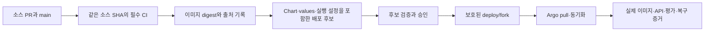

# GitOps 현황 검수와 후속 개발 전략 — 2026-09-29

현재 구성은 **개인 포크의 로컬 개발·GitOps 실습 기반으로는 타당하다. 전체 LLMOps의 운영 배포가 완성됐다고 판단할 근거는 부족하다.** 가장 먼저 해결할 문제는 이미지 발행 가드와 실제 Argo 배포 대상의 불일치다. 이미지 CI가 실패해도 `main`의 Chart·values 변경은 별도로 Argo에 전달될 수 있다.

아래 초기 진단은 분석 시점의 기록이다. G0와 G1의 후속 구현 상태는 각 절에 구분했다. G1 후보 코드·검사 workflow는 구현했지만 원격 배포 브랜치·보호 규칙·실제 Argo 전환은 아직 적용하지 않았다. migration Job 등 G2 이후 작업도 남았다.

## 분석 기준과 확인 범위

| 항목 | 확인한 기준 |
|---|---|
| 로컬 작업 브랜치 | `skn-43`, `fe39c03b8a00d211fa9a8a0498d95d36415cfbf8` |
| 조회한 개인 포크 | `ilil1/SKN34-4th-1Team` |
| 최신 `origin/main` | `baae7bd45298db2bd206d6d6bfdf7416bd47a53b`, PR #88 병합 커밋 |
| 코드 비교 | 위 두 커밋의 `infrastructure/gitops`, `infrastructure/release`, `.github/workflows`, `docs/msa-image-release.md` 차이 없음 |
| 원격 상태 관찰 | 2026-09-29 04:07~04:15 KST. 이후 실행·설정 변경은 별도 확인 필요 |
| 교육기관 원본 | `SKNETWORKS-FAMILY-AICAMP/SKN34-4th-1Team/main`도 위 병합 SHA이며 `protected=false` 확인 |
| 실제 클러스터 | 이번 감사에서 접속·변경하지 않음. 이 Windows 체크아웃에는 `.local/fork/settings.json`이 없음. WSL·다른 PC의 실행 상태를 뜻하지 않음 |

판정은 **코드에서 확인한 사실**, **GitHub에서 관찰한 사실**, **그로부터 추론한 장애 경로**, **과거 실행 기록**을 구분한다. 기존 EC2 Compose 배포까지 GitOps로 전환됐다고 해석하지 않는다.

## 영상에서 적용할 관점

대상은 양실장의 바이브코딩대학의 [에이전트 관제 시스템 구축 시연](https://www.youtube.com/watch?v=wSIy25_JWYI)이다. 공개 설명과 챕터를 확인했다. 자막 요청은 빈 응답을 반환했고 브라우저 도구도 시작하지 못해, 전체 발언·화면·시연 성공 여부는 검증하지 못했다. 아래는 설명·챕터에 근거한 주제 분석이며 발언 인용이 아니다.

| 공개 챕터의 주제 | 우리 시스템에 적용할 판단 기준 |
|---|---|
| 01:28 관측의 필요성, 33:19 실행 추적 | 소스 SHA → CI 실행 → 이미지 digest → 배포 revision → 실제 요청·평가 결과를 연결해야 한다. 초록색 워크플로 하나로 완료를 판정하지 않는다. |
| 05:38 설계부터 검증까지의 과정, 08:24 사전 검토 | 배포 전 검토 대상은 이미지뿐 아니라 설정·스키마·권한·복구 계획까지 포함한 구체적인 변경물이어야 한다. |
| 12:02 역할 분리 | CI는 검증·빌드, 승격 작업은 배포 상태 갱신, Argo는 동기화, 운영자는 승인·복구를 담당한다. |
| 25:58 외부 연동, 42:00 기능 검증 | 인증 만료·연동 실패·프로세스 종료·데이터 보존을 실제 실행으로 확인한다. |

오른쪽은 영상 주제를 GitOps에 적용한 **이번 감사의 해석**이다. 영상은 GitOps 설계의 기술 명세가 아니다. LangGraph·Supervisor 도입이나 Langfuse를 LangSmith로 교체해야 한다는 결론을 낼 근거도 없다. 현재 제품의 구체적인 역할 분리가 필요해지기 전까지 범용 Agent 계층은 추가하지 않는다.

## 현재 설계에서 유지할 부분

- [발행 가드](../infrastructure/release/gate.py)는 같은 소스 SHA의 5개 워크플로·16개 필수 작업을 확인한다. 누락·취소·건너뛰기·재실행 경합을 성공으로 처리하지 않고, 교육기관 원본에 병합된 내용인지도 확인한다.
- [이미지 발행](../infrastructure/release/publish.py)은 추적된 Git 트리에서 빌드하고 registry digest와 발행 기록을 남긴다. [승격 도구](../infrastructure/gitops/scripts/sync_images.py)는 저장소·실행·소스 트리·산출물의 일치와 최신 상태를 재검사한다.
- [클러스터 도구](../infrastructure/gitops/scripts/fork_cluster.py)는 전용 kind·소유권·loopback 경계를 검사한다. 개발 모드의 로컬 변경과 Argo 자동 동기화가 동시에 Deployment를 수정하지 않도록 분리한다.
- AppProject의 서비스 배포 범위는 해당 포크·namespace의 Deployment/Service로 제한돼 있다. 서비스 자동 삭제에서 DB·PVC를 분리하고 `prune=false`를 명시한 것은 현재 데이터 보존 정책에 맞는다.
- [서비스 Chart](../infrastructure/gitops/charts/govbiz-service)는 비특권 실행·읽기 전용 루트 파일시스템·권한 제거·리소스 제한·probe를 선언한다. 유료 AI와 외부 부작용의 기본 비활성화도 유지한다.
- [2026-09-21 기록](fork-gitops-validation-20260921.md)에는 Intel Mac의 개인 비공개 GHCR 발행·pull, 네 Application의 Synced/Healthy, 설정 drift의 self-heal을 실제 확인한 증거가 있다. 다만 과거 커밋·환경의 증거다.

[OpenGitOps 원칙](https://github.com/open-gitops/documents/blob/main/PRINCIPLES.md)에 대조하면 서비스 manifests의 선언, Git 이력, Argo의 자동 pull·지속 동기화는 구현돼 있다. 실행 설정 일부가 Git 밖에 있고, 검증된 배포 상태만 선택하도록 강제하는 경계가 부족하다. GitOps 방식의 구현 여부와 운영 준비 완료는 별개로 판정해야 한다.

## 심각도별 발견 사항

P0는 안전한 자동 승격·배포의 선행 조건, P1은 LLMOps를 실제 운영 경로로 제공하기 위한 조건, P2는 운영 범위·규모에 따라 추가할 항목이다.

| 등급 | 발견 사항 | 근거와 영향 |
|---|---|---|
| P0 | 이미지 가드가 Chart·설정의 직접 반영을 막지 못함 | `fork_cluster.py::argo_resources`가 `targetRevision=fork.branch`, 공통 Chart와 fork values, 자동 sync를 함께 설정한다. 기본 브랜치는 `main`이다. 이미지 발행과 무관한 설정 변경 경로가 남는다. |
| P0 | 원격 변경 통제가 설정되지 않음 | 개인 포크 `main`: `protected=false`, 적용 rules `[]`. `msa-release`: `protection_rules=[]`, 배포 branch policy `null`. 교육기관 `main`도 `protected=false`. 파일에 쓴 정책만으로 merge·배포 승인 강제가 되지 않는다. |
| P0 | 최신 LLMOps 통합 CI 실패 | `fe39c03`과 병합 `baae7bd` 모두 취소 smoke 준비 단계에서 실패. 11개 시나리오의 실제 통합 통과를 선언할 수 없다. |
| P1 | Ops의 Kubernetes 실행 계약이 최신 기능에 뒤처짐 | fork values에 Core·Prefect 연결과 LLMOps 결과·데이터셋 저장소 연결이 없다. migration 실행도 배포 경로에 없다. |
| P1 | 비밀이 아닌 실행 설정 일부가 Git 밖에 있음 | 로컬 `integrations.json`으로 기능·모델 키 선택을 만들고 Argo `valuesObject`에 적용한다. Git만으로 같은 실행 상태를 재구성할 수 없다. |
| P1 | 최신 배포·복구의 반복 가능한 증거 부족 | Infra CI는 정적 렌더링·정책·단위 검증 중심이다. 실제 Argo A→B→A 도구는 있지만 필수 CI에서 실행하지 않는다. 현재 실제 실행 digest는 이번 감사에서 확인하지 않았다. |
| P1 | 상태 저장 데이터 복구 경계가 미완성 | 로컬 단일 MySQL·PVC 보존은 백업·복원 검증을 대신하지 않는다. LLMOps 결과물 보존과 DB 호환 롤백도 함께 정의해야 한다. |
| P2 | 공급망·운영 가시성 보강 | receipt 검증은 유효하지만 서명·취약점 판정·배포 관측을 모두 대신하지 않는다. HA·자동 확장은 개인 로컬 단계의 선행 조건으로 올리지 않는다. |

### P0: CI가 실패해도 설정은 바뀔 수 있는 경로

현재 연결은 다음과 같다.

```text
소스 main → 필수 CI → 이미지 발행 → digest를 main에 기록
     └──── Chart / values 변경 ────→ Argo 자동 동기화
```

예를 들어 이미지 digest를 그대로 두고 서비스 URL·환경변수·probe·리소스 설정을 `main`에서 변경하면, Argo가 그 변경을 읽는 시점에 이미지 CI 성공 여부를 확인하는 장치가 없다. 설정은 Helm 렌더링이 가능하지만 런타임에서 잘못 동작할 수도 있다. 이는 **코드로부터 도출한 우회 가능성**이며 이번에 실운영 사고를 관찰했다는 뜻은 아니다.

Argo는 Git의 원하는 상태를 보고 동기화한다. GitHub CI 결과를 자동으로 배포 조건으로 삼지는 않는다. 따라서 **검증·승인을 마친 전체 배포 상태가 Argo의 입력이 되도록** 해야 한다. [Argo 자동 동기화 문서](https://argo-cd.readthedocs.io/en/stable/user-guide/auto_sync/)

### P0: 실제 원격 CI와 승인 상태

관찰 시점의 `main=baae7bd` 결과:

| 실행 | 확인한 결과 |
|---|---|
| [Infra CI](https://github.com/ilil1/SKN34-4th-1Team/actions/runs/36468708423) | 성공 |
| [Catalog CI](https://github.com/ilil1/SKN34-4th-1Team/actions/runs/36468708650) | 성공 |
| [Ops CI](https://github.com/ilil1/SKN34-4th-1Team/actions/runs/36468708516) | 성공 |
| [LLMOps CI](https://github.com/ilil1/SKN34-4th-1Team/actions/runs/36468708595) | 실패: `docker compose ... port cancellation-probe 8099`가 종료 코드 1 반환 |
| [GovBiz CI](https://github.com/ilil1/SKN34-4th-1Team/actions/runs/36468708560) | 성공: Container integration까지 완료 확인 |
| [이미지 후보 발행](https://github.com/ilil1/SKN34-4th-1Team/actions/runs/36469757724) | 워크플로 성공, 실제 `publish` 작업은 skipped |
| [이미지 승격](https://github.com/ilil1/SKN34-4th-1Team/actions/runs/36469790107) | 워크플로 성공, 실제 선택 단계는 `No promotion: no complete successful image release` |

[skn-43 실패 실행](https://github.com/ilil1/SKN34-4th-1Team/actions/runs/36467702501)의 `cancellation.json`은 `passed=false`, `failure=CalledProcessError`, `scenarios=[]`다. 두 실행 모두 `Smoke.ready()`의 최초 probe 주소 조회에서 멈췄다. 포트 조회의 stderr·inspect 자료가 부족하므로 네트워크 격리나 Docker 버전 문제라고 원인을 확정하지 않는다. 무료 단위 검증 통과와 실제 11개 통합 시나리오 통과를 구분해야 한다.

이 결과는 이미지 가드가 실패를 막고 있다는 증거이기도 하다. `blocked / waiting / published / promoted / deployed / verified` 상태를 따로 노출해야 초록색 워크플로를 배포 성공으로 오인하지 않는다.

`msa-release`는 발행 job에서 사용하지만 현재 승인 규칙이 비어 있다. [승격 workflow](../.github/workflows/msa-promotion.yml)의 `promote` job에는 environment 지정도 없다. 발행 environment에 reviewer만 추가해도 실제 배포 상태 쓰기까지 승인되는 구조가 되지는 않는다. [GitHub environment 공식 설명](https://docs.github.com/en/actions/how-tos/deploy/configure-and-manage-deployments/manage-environments)

### P1: Ops가 Ready여도 평가 기능은 준비되지 않을 수 있음

[Ops values](../infrastructure/gitops/environments/fork/ops-service.yaml)는 Django·DB 설정 중심이다. [Django 설정](../backend/ops-service/config/settings.py)의 기본 `CORE_API_URL=http://127.0.0.1:8080`은 별도 Core Pod를 가리키지 않는다. Prefect 기본 주소도 loopback이다. [런타임 오버레이](../infrastructure/gitops/scripts/connected_runtime.py)는 Ops를 제외하므로 그 경로로도 보충되지 않는다.

현재 네 서비스 Chart에는 평가 runner·ops-sync·Prefect·Langfuse 배포와 공유 결과 저장소·평가 데이터셋 연결이 없다. 이 구성요소는 [LLMOps Compose](../infrastructure/llmops/README.md)에서 별도로 관리한다. 따라서 Kubernetes의 Ops Pod 배포를 전체 LLMOps 배포로 표현하면 안 된다.

또한 [Ops 이미지](../backend/ops-service/Dockerfile)는 Gunicorn을 실행하며 migration은 별도 책임이다. GitOps 경로에는 Django migration Job이 없고 [readiness](../backend/ops-service/apps/health/views.py)는 `SELECT 1`만 실행한다. 빈 DB가 연결 가능하면 Ready여도 업무 테이블은 없을 수 있다. 소스의 `test_migration_guards.py`는 저장소 이전 경계 테스트로, DB migration 검증의 증거가 아니다.

[선택된 release 기록](../infrastructure/gitops/environments/fork/release.json)의 `verifiedRevision`은 `23a268343a9176b2a2fcc4cd76de365b4426db93`, 발행 run은 `35542678635`다. 이것은 선택된 이미지의 출처이며 현재 클러스터에서 그 이미지가 실행 중이라는 증거는 아니다. 최신 기능과 선택 이미지의 차이를 별도로 보여줘야 한다.

## 권고 구조: 같은 저장소에서 소스와 승인된 배포 상태 분리

현재 규모에서는 저장소를 늘리기보다 **같은 개인 포크의 보호된 `deploy/fork` 브랜치**를 배포 입력으로 추가하는 방안을 권고한다. 이 브랜치를 사용하는 후보 코드와 검사 workflow를 후속 구현했으며, 원격 브랜치 생성과 보호 규칙 설정은 별도 활성화 작업이다. 별도 설정 저장소도 가능하지만, 저장소 분리 자체보다 접근 통제와 검증된 변경의 선택이 먼저다. [Argo 구성 저장소 권고](https://argo-cd.readthedocs.io/en/stable/user-guide/best_practices/)



배포 후보는 `source SHA`, 이미지별 digest, Chart 내용, 환경 values, 비밀이 아닌 기능·모델 설정, Secret 참조와 필요한 버전, 스키마 호환 조건, 검증 실행 ID, 렌더링 결과의 해시를 함께 고정한다. 비밀값을 Git에 넣는다는 뜻은 아니다. 현재 로컬 Secret 생성 방식은 개발용으로 유지할 수 있지만 복원·회전 책임과 참조 버전은 명확히 한다.

소스 `main`의 Chart를 계속 직접 읽거나 이미지 파일만 배포 브랜치로 옮기면 문제가 남는다. Argo가 읽는 Chart·values 전체가 승인된 후보와 일치해야 한다. Application·AppProject도 재현 가능한 선언으로 관리하고, bootstrap 후 임의 `valuesObject` 변경으로 배포 정책을 우회하지 못하게 한다.

승격은 전체 후보를 하나의 Git commit으로 원자적으로 갱신한다. 다만 네 Application의 실제 rollout은 원자적이지 않으므로 혼합 버전의 API·DB 호환성을 검증하고 모두 준비될 때까지 배포 완료를 선언하지 않는다. stale 후보·동시 승격·승인 후 내용 변경은 거절한다.

## 실행 순서와 완료 기준

### G0 — 현재 CI 실패 복구와 결과 표시 개선

담당 책임: LLMOps 검증 코드와 CI 관리.

1. `cancellation_smoke.py`가 실패 시 Compose stderr, `ps`, 포트 바인딩·컨테이너 상태와 제한된 로그를 비밀값 없이 보존하도록 한다. 먼저 주소 조회 실패를 재현하고 원인을 확정한다.
2. 외부 egress 차단·loopback 바인딩을 유지하는 수정으로 해결한다. 테스트를 skip하거나 격리를 해제해서 초록색으로 만들지 않는다.
3. 승격 결과에 차단 사유·소스 SHA·실제 publish 여부를 구조화해 기록한다.

**완료 증거:** 최신 수정 SHA의 11개 시나리오가 모두 기록되고 `passed=true`. 필수 CI 작업 전체가 실제 성공. 같은 SHA의 발행·승격 여부가 각각 구분돼 표시됨. 그 전에는 skn-43 통합 검증 완료로 보고하지 않는다.

G0 후속 개발: Docker 29.6.2의 일회용 컨테이너에서 내부 HTTP 200과 호스트 포트 게시 누락을
함께 재현했다. `docker compose exec`로 내부 HTTP를 실행하도록 바꾸고 공개 포트 의존성을
제거했다. 시작 전 격리 검사와 실패 단계·컨테이너 상태·인증값 제거 진단을 추가했다. 무료 관련
테스트 43개와 Compose 렌더링·Ruff는 통과했다. Windows 호스트 + Docker Desktop Linux Engine
29.6.2에서 실제 11개 시나리오도 모두 통과했고, 전용 프로젝트의 컨테이너·네트워크·볼륨 정리를
확인했다. 로컬 결과는 `work/llmops-ci/cancellation-local-v2.json`에 있다.

후속 확인: `skn-45 / 8a899615a77c330449a285f6695cf57442796c71`의 필수 CI 5개와 하위 job
16개가 모두 성공했다. [LLMOps CI](https://github.com/ilil1/SKN34-4th-1Team/actions/runs/36477914362)의
`llmops-cancellation-8a899615a77c330449a285f6695cf57442796c71` artifact에서 필수 시나리오 이름 11개,
각 `passed=true`·실행기 종료·정리 실패 없음을 확인했다.
[GovBiz](https://github.com/ilil1/SKN34-4th-1Team/actions/runs/36477914331),
[Catalog](https://github.com/ilil1/SKN34-4th-1Team/actions/runs/36477914329),
[Ops](https://github.com/ilil1/SKN34-4th-1Team/actions/runs/36477914347),
[Infra](https://github.com/ilil1/SKN34-4th-1Team/actions/runs/36477914397)도 같은 SHA의 필수 job을 대조했다.
이는 취소 통합 수정의 원격 검증 결과이며 새 결과 표시 코드의 CI 증거가 아니다.

G0의 남은 결과 표시 구현은 [발행·승격 결과 안내](../infrastructure/release/README.md#발행승격-결과-확인)에
기록했다. gate 차단 사유·소스 SHA, 서비스별 업로드/재사용/receipt 여부, 실제 원격 push와 변경 없음을
JSON·Actions Summary로 구분한다. 후보가 준비되지 않으면 렌더링·쓰기 단계를 실행하지 않으며,
결과 보고서는 네 이미지 receipt 검증을 대체하지 않는다.

로컬에서 관련 무료 테스트 80개를 검증했다(발행·gate 41개, 결과 보고 15개, 승격·workflow 계약 24개).
새 파일의 Ruff 검사·포맷과 기존 변경 파일의 실행 오류 규칙 검사를 수행했다. 기존 파일의 import 정렬·
테스트 루프 캡처 등 전체 스타일 정리는 이번 변경에 포함하지 않았다. 같은 코드에 대한 중복 전체 테스트는
실행하지 않았다. 전체 CI와 실제 Actions 결과 artifact 확인은 이번 변경을 커밋·푸시한 뒤 완료해야 한다.
원격 보호 규칙·배포 ref·실제 클러스터는 이 구현으로 변경하지 않았다.

### G1 — 승인된 전체 배포 상태와 원격 통제 구축

담당 책임: GitOps·release 코드 관리와 저장소 관리자. G0 이후 실제 자동 승격을 재개하는 기준이다.

1. 소스 브랜치와 배포 브랜치 식별자를 분리하고, 기존 receipt·출처 검사에 Chart·values·실행 설정을 포함한다. 포크 신원·교육기관 원본 병합 검사는 유지한다.
2. 배포 후보 PR에서 전체 차이와 CI 증거를 검토한다. 후보 merge 또는 쓰기 작업에만 배포 권한을 부여한다. 운영 환경의 승인 규칙은 실제 배포 상태를 쓰는 job에 연결한다. 개인 로컬 자동 승격 정책은 별도로 명시한다.
3. `main`의 PR·필수 상태 검사와 배포 브랜치의 쓰기·삭제·force-push 제한을 원격에 적용한다. release 정책·워크플로·Chart·환경 설정의 CODEOWNERS와 reviewer를 지정한다. 관리자·bot의 우회 범위를 점검한다. [GitHub 보호 브랜치 문서](https://docs.github.com/en/repositories/configuring-branches-and-merges-in-your-repository/managing-protected-branches/about-protected-branches)
4. 현재 bot의 `main` 직접 push를 그대로 둔 채 PR 필수 규칙만 켜면 승격이 막힌다. 후보 생성·검증·merge 권한을 먼저 설계하고, 검증된 초기 배포 상태와 보호 규칙을 준비한 뒤 Argo의 대상 ref를 전환한다. 전환 중에는 기존 자동 승격을 잠시 정지하는 절차와 원복 지점을 둔다.
5. 필수 PR check와 `pull_request.paths`를 맞춘다. 필요한 검증이 실행되지 않는 PR은 통과로 간주하지 않는다. `GITHUB_TOKEN` push는 후속 push CI를 만들지 않으므로 새 배포 commit의 검증을 기대만 해서는 안 된다. 후보 검증을 쓰기 전에 수행하고, 필요한 별도 실행은 명시적으로 연결한다. [GitHub 이벤트 동작](https://docs.github.com/en/actions/how-tos/write-workflows/choose-when-workflows-run/trigger-a-workflow)

**완료 증거:** 이미지 변경 없는 Chart-only·values-only 불량 후보와 CI 미완료 후보가 모두 차단됨. 승인된 후보만 배포 브랜치에 들어가고 Argo가 그 revision만 읽음. `main`에 새 설정이 들어가도 미승격 상태에서는 실행 workload가 바뀌지 않음. 원격 설정은 API 조회와 거절 사례로 증명함.

G1 구현 상태: [전체 배포 후보와 수동 승인](../infrastructure/gitops/docs/deployment-candidates.md)의 절차를 추가했다.
소스 SHA·CI run/attempt·네 receipt·Chart·values·렌더링·Argo 선언을 묶고 원본 Git blob에서 재구성해 비교한다.
bot은 후보 PR만 생성하며 신뢰된 기본 브랜치 검사기가 정확한 후보 SHA에 required status를 게시한다.
사용자가 PR 리뷰 후 수동 병합을 선택했다. Argo와 GHCR 초기화는 승인된 snapshot을 읽고 로컬 `valuesObject` 우회를 거절한다.
Catalog·LLMOps PR 경로 필터도 제거해 필수 상태 검사 누락을 방지했다.

로컬에서는 관련 무료 테스트 104개(중복 제외)와 실제 Helm 오프라인 렌더링·정적·구문·문서 검사를 확인했다.
**아직 G1 완료가 아니다.** 원격 Ruleset·리뷰 담당자·bypass 감사·브랜치 초기화, 실제 거절 사례와 Argo 전환 검증이 남았다.
검사 후 main이 전진하는 사건과 수동 merge 사이의 ref 간 원자성도 보장하지 않으므로 병합 직전 최신 상태를 확인해야 한다.
현재 후보는 무료 실행 정책에 한정되며 기존 유료 연동 프로필을 자동 이전하지 않는다.

G1 원격 검증 정정: `7d87e60371b26e00fc8efded41ab17d499d1604b`의 5개 workflow 중
4개는 성공했지만 [Infra run 36488308755](https://github.com/ilil1/SKN34-4th-1Team/actions/runs/36488308755)의
`kubernetes-manifests`가 pinned Helm 누락으로 실패했다. 별도 `helm-gitops` job은 통과했다.
후속 구현에서 전체 테스트를 발견하는 두 job 모두 Helm 4.3.0과 checksum 검증을 설치하도록 맞췄다.
이 로컬 수정의 최신 SHA CI 결과는 푸시 후 확인해야 한다.

### G2 — Ops의 실제 배포 계약 완성

담당 책임: Ops 서비스와 GitOps 배포 계약 관리.

1. Core·Prefect 주소, 인증 경계, 데이터셋 버전·mount, 결과 저장소·권한, 필요한 Secret 참조를 선언한다. 비밀이 아닌 동작 설정은 버전 관리한다.
2. Django migration을 명시적인 일회성 Job으로 실행하고 실패 시 새 앱의 준비 완료·후속 배포를 차단한다. 현재 AppProject는 Deployment/Service만 허용하므로 Job의 최소 권한·순서·정책 검증도 함께 바꾼다. 기존 migration 변경·데이터 삭제·무조건 DB downgrade는 하지 않는다.
3. 자체 스키마 준비 상태와 최소 업무 API를 검증한다. liveness에 모든 외부 서비스를 넣어 연쇄 재시작을 유발하지 않는다.
4. 평가 runner·ops-sync·Prefect·Langfuse·저장소의 배포 책임을 먼저 확정한다. 단기에는 현재 Compose LLMOps를 별도 관리 대상으로 명시하고 연결 계약부터 완성한다. 전체 LLMOps의 Kubernetes 운영이 목표라면 해당 구성요소와 영속 데이터도 별도 선언·검증 단계로 이전해야 완료다.

**완료 증거:** 비어 있는 격리 DB에서 배포·migration·Core 관리자 확인·저장된 캡처 평가·결과 조회가 실제 성공. 재시작 후 결과 유지. migration 실패·인증 실패·저장소 쓰기 실패를 Ready나 평가 성공으로 오인하지 않음. 유료 호출은 이 단계의 검증 조건에 포함하지 않음.

G2 1차 구현: [Ops migration과 readiness](../infrastructure/gitops/docs/ops-migration.md)를 추가했다.
빈 DB·미적용/불일치 migration·실제 테이블/컬럼 누락은 503으로 차단하고 liveness는 DB와 분리한다.
같은 Ops 이미지·설정의 PreSync Job, MySQL 동시 실행 잠금, 실패 Job 보존,
로컬/Compose/격리 smoke의 명시적 실행 순서를 연결했다. 새 후보는 v2 계약을 필수로 검사하고
기존 v1 배포 이력의 재구성 검증은 유지한다. 원격 보호 규칙·클러스터·운영 DB는 변경하지 않았다.

Ops CI에 빈 MySQL 8.4 → migration → readiness, 반복 실행 데이터 보존,
실제 lock 경합과 컬럼 누락 감지 검증을 추가했다. 실행 결과는 아직 CI 대기다.
로컬 검증: DB 없는 Ops 단위 테스트 7개, 배포 후보 20개, Helm·migration·smoke 안전장치·workflow
관련 테스트 66개가 통과했다(총 93개, 중복 제외). 새 테스트의 잘못된 Application 이름을 수정한 뒤
실패한 1개만 다시 실행해 통과했다. Ops Ruff와 문서 경계 검사를 확인했다.
사용자 지침의 Python 3.13과 저장소의 `>=3.12,<3.13` 제약이 달라, 로컬 Ops 테스트는
`work/ops-schema-tools`의 Python 3.13에 `uv.lock`과 같은 Django·MySQL 드라이버·Ruff 버전을
설치해 수행했다. production Python·잠금 파일은 변경하지 않았고, CI의 `uv run --locked`
Python 3.12/MySQL 8.4 전체 검증을 대체하지 않는다.

**G2 전체 완료는 아니다.** Core·Prefect·데이터셋·결과 저장소의 배포 연결과
관리자 인증부터 저장된 캡처 평가·결과 조회·재시작 후 유지까지의 실제 E2E가 남았다.

G2 migration 후속 CI 확인: `skn-54 / 08f4051c1e1e2fe210dc270ff3c6e5949348083c`의
5개 workflow·16개 필수 job이 모두 성공했다.
[Ops CI](https://github.com/ilil1/SKN34-4th-1Team/actions/runs/36529070375)의 빈 MySQL 스키마·
migration 단계와 컨테이너 검증도 실제 성공했으며,
[Infra CI](https://github.com/ilil1/SKN34-4th-1Team/actions/runs/36529070393)의 Helm 누락 수정도 확인했다.
이는 이전 migration 커밋의 증거이며 아래 새 진단 구현의 원격 CI 결과는 아니다.

G2 다음 구현: 사용자는 **Prefect·평가 실행기·결과 저장소를 Compose에 유지**하는 방식을 선택했다.
[연결 계약과 진단](../infrastructure/gitops/docs/ops-runtime.md)에 데이터·권한·배치 책임을 정리했다.
새 local values·후보 템플릿에서 Core 인증 주소와 loopback CSRF 쿠키 설정을 수정하고,
미연결 Prefect 주소·평가 자료/결과 경로·유료 실행 금지를 명시했다.
관리자 전용 `/api/v1/ops/runtime`과 `check_evaluation_runtime` 명령은 자료 해시·결과 경로·
Prefect 등록 및 선택한 완료 실행의 결과 무결성을 검사한다. 새 평가나 파일 쓰기를 수행하지 않고,
공유 volume의 동일성·실행기 생존·새 평가 실행 성공을 검증했다고 표시하지 않는다.
기존 Compose 무료 평가 CI에서 이 API의 인증과 실제 완료 결과 검증을 수행하도록 연결했다.

로컬 관련 무료 테스트 45개(Ops 단위 10, Helm 정책 21, smoke 판정 11, 실제 후보 렌더링/호환 3)가
통과했다. Ops 테스트는 이전과 같은 Python 3.13·잠금 버전의 격리 도구 환경을 사용했다.
새 DB 통합 테스트는 Ops CI, 실제 관리자 인증·완료 결과 접근은 LLMOps CI에서 확인해야 한다.
최신 변경은 커밋·푸시 전이다. Kubernetes↔Compose 내부 통신, 결과 저장소 공유, `ops-sync`의
DB 소유권 연결과 재시작 유지 검증이 남았으므로 실제 연결 또는 G2 완료로 보고하지 않는다.

### G3 — 실제 Argo 배포·복구 검증을 필수 증거로 연결

담당 책임: 인프라 CI와 서비스 운영 담당.

1. 기존 [GitOps 검증 도구](../infrastructure/gitops/scripts/gitops_msa.py)를 재사용해 전용 임시 kind에서 설치 → 승인된 A → B → A 상태 복원을 실행한다. 현재 최신 후보의 자동 sync·self-heal·이미지 pull·API 동작을 확인한다.
2. 모든 문서 변경마다 클러스터를 만들지 않는다. Chart·Application·승격 정책·runtime 계약 변경 및 배포 후보에는 실제 검증을 필수로 연결하고 release 가드도 새 작업 정책과 일치시킨다. 야간 실행만으로 현재 후보 검증을 대체하지 않는다.
3. 후보 hash·Git revision·실제 Pod imageID·Sync/Health·업무 probe 결과를 한 배포 기록으로 연결한다. 네 앱의 Synced/Healthy만으로 평가 기능 완료를 선언하지 않는다.
4. Git에 직전 배포 상태를 복원하는 경로로 롤백한다. 자동 sync가 켜진 상태에서 수동 rollout undo만 실행하면 원하는 상태와 충돌할 수 있다. DB는 이전 앱과 호환되는 전진 migration을 우선하고, 복구가 필요하면 검증한 백업 절차를 따른다. [Argo 자동 동기화와 rollback 제약](https://argo-cd.readthedocs.io/en/stable/user-guide/auto_sync/)
5. `prune=false`를 유지하되 제거된 Service·Deployment의 목록과 별도 삭제 절차를 둔다. 오래된 리소스가 남는 문제를 DB까지 무차별 prune하는 방식으로 해결하지 않는다.

**완료 증거:** 아래 핵심 실패 사례가 최신 후보에서 통과하고 CI 실행 링크·artifact가 남음. Windows/WSL2·Intel Mac 지원 완료는 각 실제 환경의 증거가 있을 때만 표시함.

| 반드시 검증할 상황 | 기대 결과 |
|---|---|
| Chart·values만 변경 + 필수 검사 실패 | 배포 ref와 workload 유지 |
| 오래된 후보·잘못된 receipt·동시 승격 | 쓰기 거절, 기존 release 유지 |
| registry 인증 만료·잘못된 digest | 명시적인 배포 실패, 성공 표시 금지 |
| migration 실패·빈 스키마 | 새 배포 준비 완료 차단, 기존 데이터 보존 |
| 수동 workload drift | 선언된 상태로 복원, 민감값 로그 유출 없음 |
| A→B→A 복원 | 해당 앱·설정 복원과 실제 API 확인, DB 호환성 확인 |
| 평가 중 runner 재시작·취소·응답 손실 | 프로세스·예산·결과 상태 일치, 중복 실행 통제 |

### G4 — 데이터 복구와 필요한 운영 통제 확장

담당 책임: 데이터·운영 담당. 외부 사용자를 받는 운영 전환 전에 완료한다.

- DB와 결과물의 보존 범위·백업 주기·복구 목표를 정하고 격리 환경에서 실제 복원한다. 행·참조·결과 파일 무결성과 소요 시간을 기록한다. PVC Retain만으로 백업 완료라고 하지 않는다.
- 실패한 배포·장시간 OutOfSync·미확인 예산·결과 저장 실패의 관측과 알림 책임을 정한다. GitOps 상태, LLM 요청 추적, 답변 품질 평가는 별도 지표로 연결한다.
- 필요한 통신만 허용하는 정책은 실제 CNI가 집행하는지 거절 테스트로 확인한다. 정책 YAML 존재만으로 격리를 주장하지 않는다.
- 운영 노출 범위에 맞춰 이미지 서명·취약점 검사·Secret 회전과 복구를 추가한다. 캐시된 이미지 재사용 시 보안 갱신 기한도 정한다.
- replicas·RollingUpdate·HA는 중복 작업·DB 호환성·부하 측정 후 확대한다. 현재 단일 인스턴스/Recreate를 숫자만 바꾸어 고가용성으로 표현하지 않는다.

**완료 증거:** 합의한 복구 목표를 만족하는 실제 복원 기록, 인증 만료·격리 실패 검증, 운영 관측 기록. 이 단계까지의 근거 없이 외부 운영 준비 완료로 승격하지 않는다.

## 최초 감사의 검증과 후속 개발

최초 감사에서는 코드·Git 이력·원격 설정·CI 로그와 공개 공식 문서를 검토했다. 당시에는 이 문서와 안내 링크 3개만 변경했고 상대 링크 98개·공백·코드 블록 검사와 `git diff --check`를 통과했다. 원격 보호 규칙 변경·운영 배포·유료 평가를 수행하지 않았다. 이후 시작한 G0 구현의 검증 상태는 위 G0 절에서 별도로 갱신한다.

G0의 결과 표시 커밋 `71969f7`은 원격 CI 다섯 workflow의 성공을 확인했다. G1의 전체 후보·PR 승인 코드를 구현했으며,
최신 변경 SHA의 CI와 원격 보호·실제 전환 검증을 다음 완료 기준으로 유지한다.
Agent 관제 UI·새 오케스트레이션 프레임워크·서비스 대량 분리는 이 두 조건을 해결한 뒤 실제 필요에 따라 판단한다.
