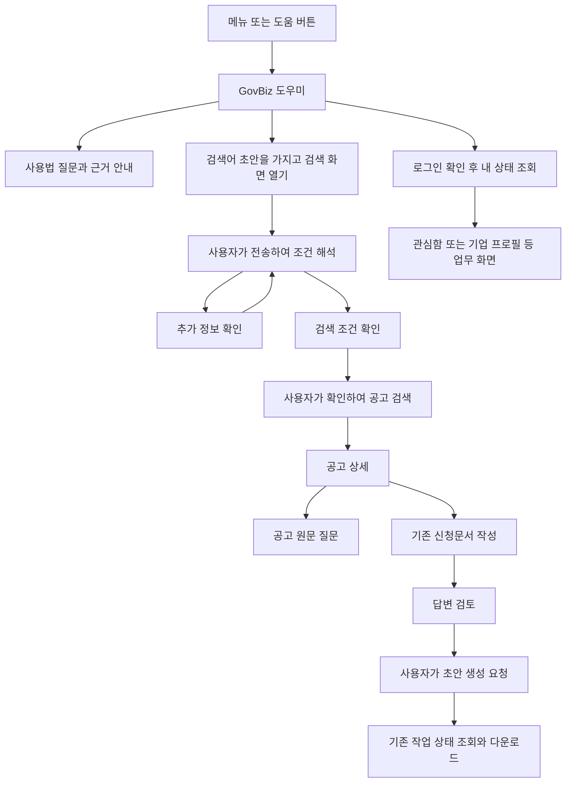

# GovBiz 모바일 챗봇 설계 초안

기준일은 2026년 10월 10일이다. 기존 모바일의 **AI 대화 검색을 유지하고, 로그인 회원에게 이동형 말풍선 버튼과 전체 화면 GovBiz 도우미를 제공**한다. 도우미는 사용법과 개인 상태를 설명하고 검색·원문 질문·신청문서 화면으로 안내한다. 검색 조건 적용과 문서 생성은 각각의 기존 화면에서 사용자가 확인한 뒤 실행한다.

skn-409 구현은 로그인 회원만 대상으로 한다. 대화와 질문 초안은 로그인 세션 메모리에 유지하며 로그아웃·재로그인·계정 전환·앱 재시작 시 초기화한다. 계정별 버튼 위치만 SecureStore에 저장한다. 아래 초기 화면 비교에서 검토한 상단 고정 아이콘과 비회원 도우미는 이번 구현에서 사용하지 않는다.

이 초안의 구현 기준은 현재 로컬 작업 트리다. 모바일과 아키텍처 문서에 포함된 기존 미커밋 변경도 읽었으므로, 아래의 현재 기능은 운영 배포 완료를 의미하지 않는다.

## 초기 설계에서 확인한 기능과 보완 범위

| 기능 | 웹의 현재 동작 | 모바일의 현재 동작 | 설계 범위 |
|---|---|---|---|
| 지원사업 대화 검색 | 자연어 해석 → 추가 질문 또는 조건 제안 → 사용자 확인 → 검색 | 같은 흐름이 `ChatScreen`에 구현됨 | 예시 질문, 조건 변경 요약, 결과의 근거 펼치기 보완 |
| 검색 결과 | 관련도·자격 근거·원문·상세·관심 저장 | 카드·자격 근거·원문·상세·관심 저장 구현됨 | 긴 인용은 접고 중요한 조건과 상세 진입을 먼저 표시 |
| 대화 기록 | 회원별 서버 저장·복원·삭제, 버전 충돌 처리 | 같은 서버 기록·30개 커서 목록·복원·삭제 사용 | 기존 검색 기록 계약 유지 |
| 원문 질문 | 선택 공고의 원문 근거 답변 | `ProgramScreen`의 질문 시트·출처·추가 질문·중지 구현됨 | 도우미에서 선택 공고와 질문 초안을 전달하는 진입 연결 |
| GovBiz 도우미 | 주제 → 질문 → 답, 개인 상태 카드, 설정에 따른 자유 AI 질문·의도별 이동 | 대응하는 모바일 도우미 화면·API 연결은 없음 | 이번 모바일 이식의 주 대상 |
| 신청문서 초안 | 공고·양식 선택 → 문항 답변 → 검토 → 생성 작업 → 다운로드 | 같은 업무 흐름·작업 복구·파일 저장/공유 구현됨 | 도우미에서 기존 작성 화면을 여는 안내 추가 |
| 담당자 문의 | 웹 채널 설정이 있을 때 외부 카카오 문의 | 모바일 서비스 문의처는 아직 미정 | 운영 문의처가 확정된 경우에만 이동 버튼 제공 |

코드 기준: [모바일 검색 채팅](../frontend/mobile/src/screens/ChatScreen.tsx), [모바일 검색 화면](../frontend/mobile/src/screens/SearchScreen.tsx), [공고 상세와 원문 질문](../frontend/mobile/src/screens/ProgramScreen.tsx), [웹 도우미](../frontend/web/src/presentation/shared/assistant/useAssistantViewModel.ts), [모바일 신청문서](mobile-application-documents.md), [모바일 README](../frontend/mobile/README.md).

## 모바일 앱 사례와 반영할 설계

다음은 공식 안내 또는 개발사가 등록한 앱 설명에 공개된 기능이다. GovBiz 적용 열은 이 프로젝트를 위한 설계 판단이며, 경쟁 서비스의 효과나 내부 구현을 측정한 결과가 아니다.

| 사례 | 공개된 모바일 사용 방식 | GovBiz에 반영할 요소 | 적용 조건 |
|---|---|---|---|
| Perplexity | 개발사 앱 설명은 답변 출처, 같은 대화의 후속 질문, 기기 간 동기화와 대화 라이브러리를 안내한다. [앱 설명](https://apps.apple.com/us/app/perplexity-ai-search-chat/id1668000334) | 답변 옆 근거 진입, 후속 질문 초안, 기존 서버 검색 기록 재사용 | 도움말 출처와 공고 원문 출처를 구분한다. 제안 클릭은 질문을 입력하고 전송은 사용자가 누른다. |
| 카카오뱅크 | 전체 메뉴의 고객센터에서 상담챗봇을 열며, 자주 묻는 질문 버튼을 통해 관련 메뉴로 이동한다. [2026년 공식 안내](https://blog.kakaobank.com/posts/kakaobank-customer-ai-fast) | 메뉴에서 찾을 수 있는 도우미, 질문 버튼, 답변 뒤 업무 화면 이동 | GovBiz의 기존 4탭을 유지한다. 문의 채널 운영 여부는 별도 확인한다. |
| Intercom Fin | 확인 질문과 답변 보완, 미해결 시 상담원 연결, 모바일 SDK의 답변 내 출처 링크를 제공한다. [공식 도움말](https://www.intercom.com/help/en/articles/11433030-conversational-fin-experience) | 모호한 질문에 확인 질문, 짧은 답변, 바로 확인 가능한 출처 | 현재 Fin의 상담원 연결은 대화 텍스트로 이뤄진다. GovBiz의 업무 버튼은 자체 앱 UI로 설계한다. SDK 도입은 포함하지 않는다. |
| Bank of America Erica | 앱 안에서 계정 정보·거래 조회·개인화 안내를 제공하며 해결하기 어려운 질문은 전문가로 연결한다. [공식 안내](https://info.bankofamerica.com/en/digital-banking/erica) | 일반 사용법과 실제 계정 상태를 구분하고 상태 확인 뒤 관련 화면 연결 | Erica는 공식 FAQ상 생성형 LLM을 사용하지 않는다. 참고 대상은 업무 연결 UX이며 GovBiz의 기존 OpenAI 경로를 유지한다. |
| Gemini 모바일 | 화면·파일·웹페이지 맥락으로 질문을 시작하는 제안 버튼을 제공한다. [공식 도움말](https://support.google.com/gemini/answer/15850607?hl=en) | 공고 상세에서 해당 공고를 선택한 채 원문 질문으로 연결 | 앱이 가진 공고 식별자만 전달한다. 화면 캡처 업로드나 다른 앱 접근 권한은 필요하지 않다. |

우선 반영할 요소는 **명확한 진입점, 짧은 답변, 검증된 근거, 확인 질문, 업무 화면 연결, 대화 보존**이다. 음성·사진 입력, 새로운 상담 플랫폼, 챗봇 전용 푸시는 초기 범위에서 제외한다.

## 화면 구성과 진입

로그인 후 하단은 기존 `검색 · 관심함 · 리포트 · 메뉴`, 비로그인 하단은 `검색 · 협업 · 요금제 · 메뉴`를 유지한다. **로그인된 주요 업무 화면의 이동형 말풍선 버튼과 메뉴의 고정 항목에서 같은 도우미를 연다.** 버튼은 길게 누른 뒤 끌어서 옮기고 가까운 좌우 가장자리에 붙인다. 안전 영역과 하단 입력·실행 영역 위로 높이를 제한한다. 키보드·기존 시트·인증 화면·앱 백그라운드에서는 버튼을 숨긴다.

이번 구현의 진입점은 루트 `AssistantProvider`와 메뉴이며 각 헤더에 새 아이콘을 넣지 않는다. 전체 화면은 기존 화면을 유지하는 네이티브 Modal로 열어 입력과 스크롤을 보존한다. 자유 AI 입력은 `EXPO_PUBLIC_ASSISTANT_AI_ENABLED=true`에서만 제공하며 기본값은 꺼짐이다. 주제별 사용법 안내는 AI 없이 제공하고, AI 장애는 오류로 표시한다.

도우미를 열었던 페이지의 이름과 주요 질문 2~3개를 대화 위에 먼저 표시한다. 검색은 조건 확인·관련도, 리포트는 추천 확인·알림·기업 정보, 공고 상세는 원문 질문·자격 확인·신청문서 안내를 먼저 제공한다. 신청문서는 선택·답변 작성·검토·생성 결과·구글폼 입력을 구분한다. `다른 주제 보기`로 전체 주제와 추가 질문을 선택하며 자유 입력은 위의 AI 활성화 설정을 따른다. 다른 페이지에서 다시 열 때 기존 대화를 초기화하지 않고 추천 질문만 바꾼다.

### 초기 화면 비교에서 검토한 헤더 진입 대안

검색·관심함·리포트는 Tabs 헤더를 사용하고 메뉴는 헤더 없이 프로필 영역으로 시작한다. 메뉴 하위 화면은 별도 Stack이며 공고 상세는 루트 Stack이다. 따라서 루트에 헤더 아이콘 하나를 등록하는 것만으로 모든 화면에 표시되지는 않는다. 각 헤더의 기존 행동을 보존하면서 같은 도우미 버튼을 배치한다.

현재 메뉴의 `도움말·문의`는 정적 서비스 안내 시트를 연다. 현재 모바일에서 자유 질문 도우미가 호출되는 진입점은 없으며 아래 배치는 신규 구현 제안이다.

| 화면 | 도우미를 여는 위치 | 현재 배치와 함께 처리할 내용 |
|---|---|---|
| 검색의 AI/필터 화면 | 헤더 오른쪽 말풍선 아이콘 | 비회원의 기존 로그인 버튼과 나란히 둔다. AI 검색 입력과 도우미 질문을 구분한다. |
| 관심 공고함 | 헤더 오른쪽 말풍선 아이콘 | 기존 공고 건수 제목을 유지한다. |
| 맞춤 리포트 | 헤더 오른쪽 말풍선 아이콘 | 기존 기업 정보 수정 연필 버튼을 유지하고 옆에 추가한다. |
| 메뉴 | 프로필 영역 오른쪽 말풍선 아이콘, 서비스 안내의 `GovBiz 도우미` 항목 | 네이티브 헤더를 새로 만들지 않는다. 기존 도움말·문의와 정책 문서는 유지한다. |
| 공고 상세 | 헤더 오른쪽 말풍선 아이콘 | 선택 공고 문맥을 보관한다. 하단의 원문 질문·관심 저장 동작을 유지한다. |
| 협업·모집글·파트너 상세 | 해당 화면 헤더 오른쪽 말풍선 아이콘 | 기존 모집글 작성 연필 버튼과 함께 배치한다. |
| 요금제·계정·기업 정보·알림 설정 | 해당 화면 헤더 오른쪽 말풍선 아이콘 | 현재 화면에 맞는 사용법으로 시작하며 개인 상태는 인증 확인 뒤 조회한다. |
| 신청문서·중복 검토 목록 | 헤더 오른쪽 말풍선 아이콘 | 기존 `새 신청 ＋`·`새 검토 ＋` 행동을 유지한다. |
| 문서 답변 작성·검토·결과 | 헤더 오른쪽 말풍선 아이콘 | 문서 문맥을 앱에 보관하고 입력을 유지한다. 문서 답변은 도우미 API에 자동 전송하지 않는다. |
| 로그인·회원가입·소셜 인증 완료·첫 소개 | 표시하지 않음 | 인증과 첫 진입 절차를 유지한다. |
| 로그인/양식 선택/원문 질문 등 시트가 열린 동안 | 배경의 도우미 버튼 접근 차단 | 동시에 두 개의 대화·시트를 열지 않는다. 닫은 뒤 원래 버튼을 다시 사용할 수 있다. |
| 도우미 화면 | 별도 호출 아이콘 없이 닫기·뒤로가기 | 중복 도우미 화면을 만들지 않는다. |

아이콘은 기존 `AppIcon`의 말풍선 모양을 사용하고 접근성 이름을 `GovBiz 도우미 열기`로 고정한다. 누름 영역은 48 이상으로 확보한다. 헤더 오른쪽에 기존 행동이 있는 경우 버튼 두 개를 한 행으로 구성하며, 좁은 화면에서 제목과 행동이 겹치지 않는지 확인한다. 도우미를 다섯 번째 하단 탭으로 추가하지 않는다.

아이콘과 메뉴 항목은 모두 신규 `/assistant` 화면으로 연결한다. 아이콘을 누르면 화면만 열며 AI를 호출하지 않는다. 사용자가 질문을 전송했을 때 기존 `/api/v1/assistant/messages`를 호출한다. 준비된 사용법 질문 버튼은 해당 안내를 로컬에서 보여 준다.

앱은 진입 시 원래 화면과 선택 공고·작성 문서 문맥을 보관한다. 닫기·Android 뒤로가기는 보던 화면으로 돌아가며 검색어·문서 입력·스크롤을 복원한다. 사용법을 읽는 것만으로 원래 화면의 미저장 입력을 초기화하지 않는다. 도우미가 다른 업무 화면으로 이동할 때는 기존 저장·이탈 제어를 거친다. 대화 상태는 계정·로그인 세대별로 상위에서 보존해 다른 화면의 아이콘으로 다시 열어도 같은 도우미 대화를 이어간다.

현재 배치 근거: [Tabs 헤더](../frontend/mobile/app/(tabs)/_layout.tsx), [검색 헤더](../frontend/mobile/app/(tabs)/index.tsx), [메뉴 본문](../frontend/mobile/src/screens/MenuScreen.tsx), [메뉴 하위 Stack](../frontend/mobile/app/(tabs)/all/_layout.tsx), [루트 Stack](../frontend/mobile/app/_layout.tsx), [리포트 헤더 행동](../frontend/mobile/app/(tabs)/report.tsx), [문서 목록 헤더](../frontend/mobile/app/(tabs)/all/preparation.tsx).

| 화면 | 구성과 동작 |
|---|---|
| AI 대화 검색 시작 | 기존 AI/필터 선택 유지. 회사 상황 입력과 예시 질문 3개. 예시는 초안만 채우고 API를 실행하지 않는다. |
| 조건 확인 | 바뀐 조건을 먼저 요약하고 `조건 자세히`에서 유지·변경 조건을 확인한다. `이 조건으로 검색`이 주 행동이다. 조건 수정은 입력창으로 연결한다. |
| 검색 결과 | 공고명·접수 상태·지원 요약·자격 확인 상태를 먼저 표시한다. 상세 진입과 원문 링크를 구분하고, 긴 근거는 `원문 근거 n건` 아래 펼친다. |
| GovBiz 도우미 시작 | 전체 화면 헤더에 닫기·새 도우미 대화. 검색 방법·관심 공고·리포트·신청문서·협업·계정/이용안내의 주제를 제시한다. 개인 상태는 로그인 확인 뒤 제공한다. |
| 도우미 답변 | 결론 1~2문장, 필요한 설명, 도움말 또는 계정 상태 출처, 다음 행동 버튼을 표시한다. 일반 답변 아래 후속 질문은 2개 이내를 기본값으로 한다. |
| 원문 질문 | 현재 공고명과 식별자를 고정한 기존 질문 시트. 답변·근거 구절·출처를 구분한다. 근거 부족도 정상적인 업무 결과로 표시하되 통신 실패와 혼동하지 않는다. |
| 신청문서 진입 | 선택 공고가 있으면 기존 새 신청 화면에 전달한다. 없으면 기존 공고 선택으로 안내한다. 생성 여부는 검토 화면에서 결정한다. |

전체 화면 도우미는 긴 답변, 키보드, 로그인 시트, 업무 화면 이동을 처리하기 쉽다. 하단 시트 대안은 짧은 사용법 확인에 적합하지만 키보드와 출처를 함께 보여 줄 공간이 줄어든다. 초기 구현은 전체 화면을 권장한다. 기존 원문 질문 시트는 유지한다.

도우미를 닫으면 원래 화면의 입력·선택·스크롤을 보존한다. 개인 상태를 묻는 도중 로그인 취소는 도우미 화면을 유지한다. 문의 버튼은 확정된 문의처가 있을 때만 노출하며, 외부 앱 실행 실패를 표시한다.

## 대표 사용자 흐름



예를 들어 `서울에서 AI 서비스를 만드는 창업기업이에요`를 입력하면 조건 제안의 지역·업종·지원 목적을 확인하고 검색한다. 결과에서 공고를 선택한 뒤 `우리 회사도 신청할 수 있나요?`는 그 공고의 원문 질문으로 보낸다. `신청서 초안을 만들고 싶어요`는 선택 공고를 가진 기존 신청문서 작성 화면을 연다. 도우미 답변만으로 검색·유료 분석·문서 생성·신청 제출을 자동 실행하지 않는다.

## API 재사용과 계약 경계

| 목적 | 기존 공개 API | 모바일 처리 |
|---|---|---|
| 도우미 자유 질문 | `POST /api/v1/assistant/messages` | 모바일 API 경계에서 Bearer 인증·DTO 검증·내부 모델 변환 추가 |
| 검색 조건 해석 | `POST /api/v1/support-programs/conversation/interpret` | 기존 `programClient.interpretConversation` 유지 |
| 확인한 조건 검색 | `POST /api/v1/support-programs/search` | 기존 검색 UseCase 유지 |
| 로그인 전 검색 결과 복원 | `POST /api/v1/support-programs/search/results` | 기존 결과 토큰으로 복원, 검색 재실행 없음 |
| 선택 공고 원문 질문 | `POST /api/v1/support-programs/detail/answers` | 기존 질문 경로와 `sourceCode + sourceProgramId` 사용 |
| 검색 대화 기록 | `/api/v1/me/chat-conversations` 및 `/{id}` | 기존 저장·조회·삭제와 `expectedVersion`, `X-Chat-Account` 유지 |
| 신청문서 | 기존 ApplicationPreparation UseCase와 생성 작업 API | 기존 요청 키·revision·작업 상태·파일 계약 유지 |

도우미 연결은 다음 경로로 설계한다.

```text
AssistantScreen → useAssistantConversation → shared AskAssistantUseCase
→ mobile AssistantRepository 구현 → mobile apiRequest
→ AssistantMessageController → AssistantMessageService
→ AiAssistantClient → 기존 AI Service 도우미 처리 → 응답
```

Core의 Account resolver는 쿠키가 없는 요청의 Bearer 세션을 지원한다. 웹의 `credentials: include` 호출을 그대로 복사하지 않고 모바일의 [apiRequest](../frontend/mobile/src/api/client.ts)를 사용한다. 응답은 [shared AssistantAnswerDto](../frontend/packages/shared/src/data/models/AssistantAnswerDto.ts)로 검증하고 `toAssistantAnswer`에서 내부 모델로 변환한다. 모바일이 AI Service나 OpenAI를 직접 호출하지 않는다.

Core의 도구 에이전트 설정이 켜진 경우에는 기존 AI Service에서 Core 내부 도구를 호출하는 경로가 추가된다. 모바일은 기존 응답의 `cards`를 렌더링하며 별도 에이전트나 실행 계층을 추가하지 않는다.

### 요청과 응답에서 보존할 값

현재 도우미 요청은 `message`, `history`, `context`, `helpEntries`를 요구한다. 질문은 최대 500자, 최근 대화는 최대 6개, 각 대화 내용은 최대 1,000자, 도움말은 1~40개다. 공통 [AskAssistantUseCase](../frontend/packages/shared/src/domain/usecases/AskAssistantUseCase.ts)의 기존 상한 처리를 재사용한다.

`context`에는 현재 화면의 경로와 `programSelected`만 있다. **공고 식별자나 문서 ID는 현재 도우미 요청 계약에 없다.** 앱이 도우미를 열 때 선택 공고를 로컬 문맥에 보관하고, 사용자가 원문 질문 버튼을 누르면 기존 질문 화면에 전달한다. 도우미 API가 원문 질문을 이미 실행했다고 표시하지 않는다.

응답의 `citations`는 도움말 항목 ID이며 원문 RAG의 URL·인용 구절과 다르다. 도움말 ID는 같은 요청에 사용한 카탈로그에서 제목과 내용을 찾는다. 계정 상태는 실제 서버 응답 시점의 본인 데이터로 표시하고, 공고 카드의 근거는 기존 공고 계약을 사용한다.

### 웹 경로와 모바일 경로 연결

서버의 `navigation.to`와 카드의 `to`는 웹 경로다. 모바일 API 응답을 그대로 `router.push`에 넣지 않고 명시적인 허용 목록으로 변환한다. 아래의 모바일 경로는 기존 경로이며 `/assistant`는 새 도우미 화면 제안이다.

| 서버 또는 도움말 경로 | 모바일 목적지 | 추가 동작 |
|---|---|---|
| `/app/chat` | `/(tabs)`의 `mode=ai` | `searchQuery`는 검색 화면의 입력 초안으로 전달한다. 명시적 적용으로 기존 초안 덮어쓰기 여부를 확인한다. |
| `/app/chat?mode=filter` | `/(tabs)`의 `mode=filter` | 질의는 로컬 원본 도움말의 action에서 복원한다. |
| `/app/saved-programs` | `/(tabs)/saved` | 로그인 확인 후 이동 |
| `/app/reports` | `/(tabs)/report` | 로그인 확인 후 이동 |
| `/app/profile` | `/(tabs)/all/account` 또는 `/(tabs)/all/company` | 프로필 일반 안내와 기업 등록 안내를 구분한다. |
| `/app/partners` | `/(tabs)/collab` 또는 `/(tabs)/all/collab` | 비회원/회원에 맞는 기존 경로 사용 |
| `/app/proposals` | `/(tabs)/all/collab`의 `view=box`, `box=received` | 기존 제안함 파라미터 사용 |
| `/app/partners/detail?recruitmentId=...` | `/partner/[id]` | 모집글 ID 검증 후 이동 |
| `/app/support-programs/detail?sourceCode=...&sourceProgramId=...` | `/program` | 두 식별자를 URLSearchParams로 읽고 공통 계약으로 검증한다. |
| 선택 공고의 원문 질문 | `/program`과 기존 질문 진입 동작 | 앱이 보관한 공고 문맥과 질문 초안 사용 |
| `/app/application-preparations/new` | `/(tabs)/all/preparation/new` | 선택 공고가 있으면 기존 `initialProgram` 파라미터 사용 |
| `/app/application-preparations` | `/(tabs)/all/preparation` | 기존 작성 목록 사용 |
| `/app/combination-reviews` | `/(tabs)/all/reviews` | 기존 검토 목록 사용 |
| `/app/pricing` | 비회원 `/(tabs)/pricing`, 회원 `/(tabs)/all/pricing` | 기존 공개 접근 정책 사용 |

`context.route`와 도움말의 `action.to`는 초기에는 기존 서버가 이해하는 웹 의미 경로로 전달한다. 서버 요청의 경로 검증에는 질의 문자열이나 Expo 그룹 표기 `/(tabs)`가 맞지 않으므로 모바일 실제 경로를 그대로 보내지 않는다. 화면별 매핑에서 질의를 제거한 의미 경로를 만든다.

알 수 없는 경로, 허용하지 않은 질의, 검증에 실패한 카드 ID는 해당 이동 버튼을 비활성화하고 이유를 안내한다. 외부 URL로 임의 이동하거나 추정한 공고로 대체하지 않는다. 도움말 출처를 눌렀을 때도 같은 ID의 항목만 연다.

## 상태와 모바일 동작

검색 대화, 도움말 도우미, 공고 원문 질문은 각각 기존 업무 문맥을 소유한다. 한 화면에서 입력한 질문을 다른 대화 이력에 자동으로 섞지 않는다. 검색 기록 저장은 기존 서버 스냅샷을 유지하고, 도우미 대화는 첫 구현에서 계정·로그인 세션에 연결한 메모리로 보존한다. 새 영속 저장이나 검색 기록 DB에 도우미 메시지를 섞는 계약은 추가하지 않는다.

| 상태 또는 사건 | 화면과 요청 처리 |
|---|---|
| 대기 | 질문 초안과 실제 보낸 질문을 구분하고 전송 중 중복 요청을 막는다. |
| 응답 처리 중 | `답변을 확인하는 중이에요`와 중지 버튼을 제공한다. 실제 서버 단계가 없는 세부 진행률은 표시하지 않는다. |
| 중지 또는 화면 이탈 | AbortController와 요청 세대 번호로 늦은 성공·오류를 폐기한다. 화면 대기 취소가 서버 실행·비용 취소를 보장하지 않는다는 기존 안내를 유지한다. |
| 확인 질문 | 아직 확정하지 않은 조건을 적용하지 않는다. 질문을 입력창에 연결한다. |
| 401 | 세션 만료를 처리한다. 개인 답변을 지우고 공개 도움말만 제공한다. |
| 429 | 서버가 검증한 대기 시간 동안 재시도를 막고 입력을 유지한다. |
| AI 또는 네트워크 장애 | 명시적 오류와 수동 재시도를 제공한다. 도움말 답변을 AI 성공으로 대신하지 않는다. |
| 오프라인 | 초안을 유지하고 연결 오류를 표시한다. 연결 복구로 AI 요청을 자동 재전송하지 않는다. |
| 앱 백그라운드 | 도우미의 화면 대기를 중지하고 상태를 표시한다. 복귀 후 자동 재전송하지 않는다. 기존 문서 작업은 기존 작업 ID로 상태를 조회한다. |
| 로그아웃 또는 계정 변경 | 도우미 상태·출처·진행 요청을 정리하고 이전 계정의 늦은 응답을 폐기한다. |
| 같은 계정 재로그인 | 새 로그인 세션으로 구분한다. 세션 키는 토큰 문자열보다 계정과 로그인 세대에 연결해 토큰 갱신과 구분한다. |
| 새 도우미 대화 | 도우미만 초기화한다. 검색 대화·공고 선택·문서 답변은 유지한다. |

키보드가 열리면 입력창은 키보드 위에 남고 본문만 스크롤한다. 기존 Stack 헤더 측정과 안전 영역 처리를 사용하며 하단 여백을 중복 적용하지 않는다. 터치 영역은 최소 48을 목표로 하고, 글자 확대에 따라 버튼 높이를 늘린다. VoiceOver/TalkBack에 열기·닫기·전송·중지·출처를 명확히 읽히고 새 답변은 완료 시 한 번 안내한다. 사용자가 과거 내용을 읽고 있으면 스크롤을 강제로 내리지 않고 `새 답변 보기`를 제공한다.

### 자유 질문 활성화

모바일용 도우미 자유 질문 설정은 새 Expo 공개 설정으로 제안하되 기본값을 꺼짐으로 둔다. 꺼진 상태에서는 주제·질문 버튼을 통한 준비된 사용법 안내를 제공하고 자유 AI 입력은 표시하지 않는다. 이는 별도의 안내 기능이며 AI 장애의 fallback이 아니다.

켜진 상태에서는 실제 모바일 지원 기능에 맞춘 도움말을 실어 기존 도우미 API를 호출한다. AI 장애는 오류로 표시한다. 웹의 `VITE_ASSISTANT_AI_ENABLED`와 Core의 도구 에이전트 설정을 모바일 활성화와 혼동하지 않는다. 새 모델 제공자·상담 SDK·production 의존성은 초기 구현에 필요하지 않다.

## 신청문서 초안과의 연결

도우미에서 `신청문서 작성 시작`을 누르면 선택 공고의 복합 식별자를 기존 새 신청 경로에 전달한다. 이 경로는 이미 `sourceCode`, `sourceProgramId`를 받아 `initialProgram`으로 사용한다. 선택 공고가 없으면 공고 선택부터 시작한다.

다음 단계는 기존 `양식 확인 → 문항 답변 → 필수 입력 검토 → 초안 생성 접수 → 작업 상태 확인 → 다운로드/공유`다. 봇 답변을 기업 사실로 저장하거나 미입력 답변을 임의 생성해 채우지 않는다. 분석·생성은 각 실행 화면에서 명시적으로 요청하고 결과 불명인 요청은 기존 요청 키로 확인한다. 생성 파일은 초안으로 표시하고 최종 제출은 사용자가 공식 신청 경로에서 수행한다.

원문 질문 초안 전달은 별도 수신 처리가 필요하다. 현재 `ProgramScreen`은 질문 동작 재개는 지원하지만 도우미에서 넘긴 질문 문자열을 소비하는 연결은 추가해야 한다. 대상 공고·질문·계정 세대를 함께 확인한 뒤 입력만 채우며 화면 복원 자체로 질문 API를 실행하지 않는다.

## 구현 파일과 책임

초기 파일 분리 제안은 아래와 같다. 실제 구현에서는 `AssistantProvider`가 로그인 세션과 전체 화면 Modal을 소유하며 `context`, `FloatingAssistantButton`, `assistantPosition`, `assistantNavigation`으로 실제 책임을 나눈다. `/assistant` 라우트와 상단 `AssistantHeaderButton`은 추가하지 않았다. 공통 DTO·UseCase와 모바일 API 경계는 아래 제안을 그대로 재사용한다.

| 위치 | 책임 |
|---|---|
| `mobile/app/assistant.tsx` 신규 | 전체 화면 도우미 경로, 닫기와 원래 화면 복귀 |
| `mobile/src/screens/AssistantScreen.tsx` 신규 | 메시지·주제·근거·업무 버튼·입력창 렌더링 |
| `mobile/src/assistant/useAssistantConversation.ts` 신규 | 대화 상태, 요청 취소, 계정/앱 수명, 오류와 재시도 |
| `mobile/src/assistant/assistantNavigation.ts` 신규 | 서버 의미 경로와 네이티브 업무 경로의 명시적 변환 |
| `mobile/src/components/AssistantHeaderButton.tsx` 신규 | 여러 실제 화면에서 사용하는 동일한 말풍선 버튼·누름 영역·접근성 이름 |
| `mobile/src/api/assistant.ts` 신규 | 기존 `apiRequest`와 shared UseCase를 연결하는 구체 Repository, DTO 검증·변환 |
| `mobile/src/content/assistantHelp.ts` 신규 | 모바일 지원 상태와 실제 사용 절차, 도움말의 의미 action 대응 |
| shared의 기존 Assistant 타입·DTO·UseCase | 공개 업무 계약과 상한·응답 검증 재사용 |
| 기존 SearchScreen·ChatScreen·ProgramScreen | 검색어/질문 초안 전달과 필요한 UI 보완 |
| 기존 MenuScreen·RootLayout·Tabs/메뉴 하위 Stack과 화면별 헤더 | 메뉴와 말풍선 진입점, 기존 헤더 행동과의 병행, 도우미 Stack 등록 |

shared 파일은 `frontend/packages/shared/src`, mobile 파일은 `frontend/mobile` 기준이다. 웹의 React DOM 컴포넌트·Redux slice·sessionStorage·라우터는 모바일로 가져오지 않는다. 현재 모바일의 React 상태와 기존 인증·API 방식을 따른다.

웹 도움말에는 웹 전용 화면 절차와 경로 의존성이 있다. 지원 범위와 단계가 같은 순수 문장·항목 ID만 실제 공동 사용이 생기는 범위에서 shared로 옮길 수 있다. 모바일만의 절차는 플랫폼 가까이에 둔다. 추출 시 기존 웹 진입 파일은 재수출로 유지하고 웹 안내의 의미가 바뀌지 않는지 검증한다. 전체 도움말·웹 ViewModel을 한꺼번에 옮기거나 새로운 범용 챗봇 프레임워크를 만들지 않는다.

Core·AI Service·DB는 초기 구현에서 기존 계약을 재사용한다. 실제 공개 계약 변경이 필요해지면 해당 생산자와 웹·모바일 소비자를 함께 수정·검증한다. 외부 AI DTO를 공개 응답으로 바로 보내거나 모바일이 내부 서비스 DTO에 의존하게 만들지 않는다.

## 구현 순서와 수용 기준

| 순서 | 변경 범위 | 수용 기준 |
|---|---|---|
| 1 | 도우미 경로·메뉴 진입·주제별 사용법·근거 보기 | 비회원도 사용법 조회 가능, 닫기 후 원래 입력·스크롤 유지, 현재 모바일 지원 상태에 맞는 안내 |
| 2 | 자유 AI 질문·Bearer API·의도별 렌더링·오류 | shared DTO 사용, 실제 계정 상태 구분, 401·429·장애·중지·계정 전환 처리, AI 꺼짐 동작 명확 |
| 3 | 검색어·선택 공고·질문 초안·신청문서 업무 연결 | 이동만으로 AI 호출 없음, 복합 ID 보존, 로그인 취소 후 입력 유지, 문서 요청 중복 생성 없음 |
| 4 | 검색 카드 근거 접기·후속 질문·읽는 위치 보존 | 원문 확인 가능, 추천 문구 클릭은 초안 작성, 기존 검색·기록·관심 저장 동작 유지 |

각 단계는 작업 분리 단위다. 실제 변경 작업에서는 코드·설정·테스트 작성을 모두 마친 뒤 최종 검증을 모아서 수행한다.

### 최종 검증 계획

| 검증 구분 | 대상과 완료 기준 |
|---|---|
| 로컬 단위와 스텁 | 신규 도우미 API/상태/경로 테스트와 기존 `ChatScreen.test.tsx`, `ChatScreenKeyboard.test.tsx`, `ProgramScreen.test.tsx` 중 영향 범위. AI 호출 없이 초기화·취소·늦은 응답·인증·오류·초안 전달 확인 |
| 공통 계약과 웹 회귀 | shared 응답 검증·UseCase 상한, 웹 `assistantApi.test.ts`·`useAssistantViewModel.test.tsx` 등 영향 범위. 도움말 추출 시 경로·재수출·설명 확인 |
| 모바일 정적 검사 | 변경 파일 oxlint와 `pnpm typecheck`; 실제 명령은 mobile에서 `pnpm test --runTestsByPath <대상 파일>`, `pnpm exec oxlint <변경 파일>` |
| 서버 계약 | 필요 시 JDK 21의 선택 테스트로 도우미 Controller의 비회원/Bearer·카드 검증·401·429 확인. 서버 변경 없이도 실제 회원 상태 응답은 별도 연동 확인 |
| 필수 CI | `.github/workflows/ci.yml`의 Mobile `test/typecheck/lint/export`, Web and shared 전체 검증, 서버 변경 시 해당 필수 잡. 최신 변경 커밋의 실제 통과 확인 |
| 실제 API 연동 | 로그인/만료, 내 상태, 같은 공고의 원문 질문, 검색 결과 복원, 문서 작업 복구. 유료 해석·검색·질문·생성은 승인된 데이터와 예산에서만 실행 |
| 실제 기기 | iOS·Android 키보드/안전 영역, Android 뒤로가기, 글자 확대, VoiceOver/TalkBack, 백그라운드 복귀, 외부 원문·문의 열기 |
| 문서와 변경 점검 | API·경로·도움말 내용과 계층/DTO/Mapper 경계 대조, 이동 시 이전 참조 rg 확인, 최종 `git diff --check` |

CI의 export 통과는 iOS·Android JavaScript 번들 검증이다. 실제 기기·스토어 빌드·배포 검증과 구분한다. 유료 실제 호출이나 실제 기기 확인을 스텁 테스트 결과로 대신 보고하지 않는다.

### 도입 후 판단할 지표

초기 목표는 도우미에서 관련 업무 화면까지 이어지는 것이다. 사용법 질문 후 목적 화면 도달률, 검색 초안 적용 후 조건 확인 완료율, 출처 열기 비율, 오류 후 수동 재시도 결과, 중복 실행 건수를 측정 후보로 둔다. 대화 본문이나 기업 정보를 분석 로그에 넣지 않는다. 새 분석 서비스 없이 기존 관측 수단의 수집 가능 범위를 먼저 확인한다. 현재 효과 측정값이나 성능 개선율은 없다.

### 구현 전에 정할 운영 항목

문의처와 운영 시간, 모바일 자유 AI 질문의 활성화 환경, 실제 호출 평가 데이터·예산을 확정한다. 문의처가 미정이어도 사용법·검색·문서 안내 구현은 진행할 수 있다. 문의 연결은 확정된 경로만 제공한다.

## 관련 문서

- [아키텍처와 기존 호출 흐름](architecture.md)
- [모바일 모노레포](mobile-monorepo.md)
- [모바일 신청문서 작성](mobile-application-documents.md)
- [지원사업 공개 API 계약](support-program-search-contract.md)
- [웹 도우미 구현 안내](../frontend/web/README.md)
- [도우미 요청 DTO](../backend/core-service/src/main/kotlin/ai/govbiz/core/assistant/controller/dto/AssistantMessageRequest.kt)
- [공통 도우미 업무 계약](../frontend/packages/shared/src/domain/repositories/AssistantRepository.ts)
