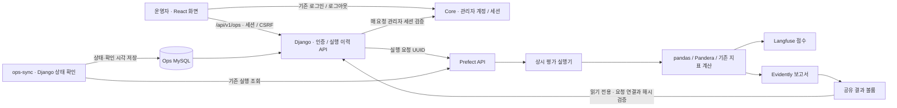
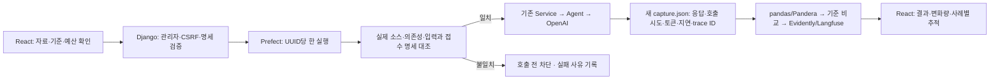

# LLMOps 개발 환경과 실행

[전략 문서](../../docs/langfuse-adoption-strategy.md) · [근거 답변 평가](../../evaluation/support-program-evidence/README.md)

구현 범위는 근거 답변 추적, **저장 응답 재평가·승인 기반 새 응답 생성 파이프라인**, React·Django 운영 화면과 관리자 응답 검토·비교 기준 지정·실패 후처리 복구다.
Langfuse 4.15.6, Prefect 3.8.6, pandas 3.0.6, Pandera 0.33.1, Evidently 0.7.23을
AI Service의 `uv.lock`으로 고정한다. 요청 처리에는 Langfuse만 설치하고 나머지는 `evaluation` 그룹으로 설치한다.
AI Service·Django Ops의 로컬·CI·Docker와 평가 실행기·Prefect 서버는 모두 Python 3.12를 사용한다.
AI 프로젝트는 `>=3.12,<3.13`으로 제한하며 `.python-version`과 `uv.lock`에 맞춰 설치한다.

## 개발 반영 현황 — 2026-09-28

지금까지 개발한 기능과 로컬 검증 범위다. 아래 상세 절에는 실행 방법과 당시 검증 기록을 보존한다.

| 영역 | 반영 내용 |
|---|---|
| 실행 환경 | AI·Ops·평가 실행기·Prefect의 Python 3.12 통일, 의존성 잠금 파일, 별도 개발 Compose |
| Langfuse 추적 | Core→AI 검색의 단계·캐시·선택·임베딩/랭킹 사용량과 근거 답변 HTTP/평가 실행기의 모델·지연·오류 연결. 본문 수집 제외 |
| 평가 파이프라인 | Prefect → pandas/Pandera 검증 → 지표 재계산 → Evidently 보고서·Langfuse 점수 등록 및 재조회 |
| 과거 응답 비교 | 저장된 가상 6건 재현, 과거 두 실행의 공통 E01 비교, 모델·프롬프트·지표 차이와 미측정 값 표시 |
| 운영 화면·인증 | React `/ops/evaluations`, Django API, 기존 Core 관리자 로그인·공유 로그아웃, CSRF·일반 회원 접근 차단 |
| 실행·결과 관리 | 요청 UUID 중복 방지, 백그라운드 상태 확인, 목록 자동 갱신·확인 지연 표시, 파일 해시 검증, 인증된 보고서·외부 기록 링크 |
| 새 모델 평가 | 자료·모델·호출 수·출력 토큰 예산 확인 후 새 응답 생성, 중복 유료 실행 차단, 실패 시 부분 캡처·호출 시도 수 보존 |
| GPT-6 Luna 실제 호출 | 환경변수 반영 후 E01 한 건을 실제 1회 호출. 토큰·trace·점수·보고서 확인. 전체 품질 평가로 해석하지 않음 |
| 관리자 검토·비교 기준 | 질문·근거·후보/기준 답변 조회, 승인·수정 필요 의견과 검토자·이력 저장, 데이터셋별 기준 지정, 접수 시 기준 해시 고정·실행별 원본 복사 |
| 품질 판정 | 기준 자료 검토와 응답 검토 분리, 정책·입력·검토 이력 고정, 실행 상태와 품질 상태 분리, 최신 품질 합격·전체 승인이 있는 실행만 기준 지정 |
| 후처리 복구 | 완료된 응답을 재사용해 보고서·점수 등록만 새 실행에서 처리. 입력 해시 고정·복사, 원본 이력 보존, 동시 접수 차단·응답 유실 재확인. 추가 모델 호출 0회 |

상세 계약은 [Ops README](../../backend/ops-service/README.md#응답-검토와-비교-기준),
화면 사용법은 [Web README](../../frontend/web/README.md#llmops-운영-화면--react--django),
평가 입력·출력은 [평가 README](../../evaluation/support-program-evidence/README.md#ops에서-새-응답-생성)에 둔다.
전체 도입 순서와 후속 범위는 [전략 문서](../../docs/langfuse-adoption-strategy.md)에서 관리한다.
현재 작업 우선순위와 진입·완료 조건은 [LLMOps 후속 개발 전략](../../docs/llmops-next-development-plan.md)을 따른다.

사례별 검토와 실행 명세 고정은 구현했다. `skn-35 / 5626586`의 Ops CI에서 새 접수 프로필이 빠진
기존 검토 테스트 1개가 실패했고 `b32efa1`에서 수정해 필수 CI 5개가 모두 통과했다.
후속 품질 판정 기능은 로컬 구현·검증을 마쳤으며 `skn-36`의 원격 CI 결과는 별도로 확인한다.
남은 범위는 실제 사람의 평가 자료 검토·확장과 현재 모델 기준 확보, 취소·정기 실행·알림,
Core부터 이어지는 전체 RAG 추적과 Ops 평가 연동, 운영 배포다. 별도 도구의 과거 전체 RAG 검증 기록과
현재 Ops의 고정 근거 평가는 구별한다. `skn-23`의 `fba8aeb`에서 원격 Ops CI가 실행됐으며,
단독·루트 Compose의 평가 자료 마운트 누락으로 컨테이너 검토 테스트 7개가 실패했다.
해당 마운트와 경로 검증을 수정해 로컬 격리 MySQL 컨테이너의 35개 테스트·HTTP·서비스 DNS 검증을 통과했다.
같은 커밋의 GovBiz CI에서 실패한 AI 기본 모델 테스트의 이전 모델 기대값도 수정해 관련 선택 테스트를 통과했다.
`skn-25`의 `0b7eebf`에 두 수정과 후처리 복구를 커밋·푸시했으며 필수 CI 5개가 모두 통과했다.
[GovBiz CI](https://github.com/ilil1/SKN34-4th-1Team/actions/runs/36314606993),
[Ops CI](https://github.com/ilil1/SKN34-4th-1Team/actions/runs/36314607015),
[LLMOps CI](https://github.com/ilil1/SKN34-4th-1Team/actions/runs/36314606996),
[Infra CI](https://github.com/ilil1/SKN34-4th-1Team/actions/runs/36314606978),
[Catalog CI](https://github.com/ilil1/SKN34-4th-1Team/actions/runs/36314606992)에서 확인한다.
상태 동기화·복구 smoke 변경은 `skn-26 / b7722a7`로 푸시했고 CI 5개가 통과했다. 운영 배포는 미수행이다.

## 개발 서버

저장소 루트에서 실행한다. Docker에는 약 8GB의 메모리를 확보하고, 13000·14200 포트가 비어 있는지 확인한다.
Langfuse Web·Worker, PostgreSQL, ClickHouse, Redis, MinIO와 Prefect를 별도 Compose 프로젝트에 둔다.
이미지는 digest로 고정하며 업무 서비스의 데이터베이스·볼륨을 공유하지 않는다.

```bash
python3 infrastructure/llmops/init_env.py
docker compose --env-file infrastructure/llmops/.env \
  -f infrastructure/llmops/compose.yaml --profile evaluation up -d
```

생성한 `.env`는 Git에서 제외되고 권한은 `0600`이다. 기존 파일은 덮어쓰지 않는다.
초기 DB migration과 사용자 생성이 끝날 때까지 수 분이 걸릴 수 있다.
Langfuse는 [localhost:13000](http://localhost:13000), Prefect는 [localhost:14200](http://localhost:14200)에서 확인한다.
Langfuse 이메일은 `llmops@localhost.test`, 비밀번호는 생성한 파일의 `LANGFUSE_ADMIN_PASSWORD`다.
두 UI는 loopback에만 공개한다. Prefect의 이 개발 구성에는 별도 인증을 설정하지 않는다.

개발 데이터는 named volume에 남는다. **7일 자동 삭제 정책은 아직 설정하지 않았다.**
운영 배포·보존 정책·외부 접근 인증은 별도 운영 작업이다.
종료할 때 다음 명령은 컨테이너만 정리하며 기록 볼륨은 유지한다.

```bash
docker compose --env-file infrastructure/llmops/.env \
  -f infrastructure/llmops/compose.yaml --profile evaluation down
```

## Django 운영 화면

화면은 기존 `frontend/web`의 React로 제공하고 Django는 인증·평가 API를 담당한다.

운영자가 브라우저에서 저장 자료 평가를 요청하고 실행 이력·결과를 확인하는 개발 구성이다.
[Ops 기능과 API](../../backend/ops-service/README.md#llmops-운영-화면)를 함께 참고한다.
Django는 별도 전용 MySQL을 사용한다. 기존 업무 Ops DB·계정·Langfuse 키를 변경하지 않는다.

기본 `.env`가 없는 경우 위 `init_env.py`를 먼저 실행한다. 다음 명령은 저장소 루트에서 실행하며,
`.env.ops`가 이미 있다면 생성 명령은 생략한다. 기존 파일은 덮어쓰지 않는다.

```bash
python3 infrastructure/llmops/init_ops_env.py

dc() {
  docker compose --env-file infrastructure/llmops/.env \
    --env-file infrastructure/llmops/.env.ops \
    -f infrastructure/llmops/compose.yaml \
    -f infrastructure/llmops/compose.ops.yaml --profile evaluation "$@"
}
dc up -d ops-mysql
dc build ops-service ops-sync evaluation-runner
dc run --rm ops-service python manage.py migrate --noinput
dc up -d ops-service ops-sync evaluation-runner

```

React 웹은 별도 터미널에서 저장소 루트 기준으로 실행한다(Node 24.x/pnpm 11.22.x).

```bash
pnpm install --frozen-lockfile
pnpm dev:web
```

[Core API](../../backend/core-service/README.md)를 먼저 실행하고
[운영 화면](http://localhost:5173/ops/evaluations)에서 **기존 프로젝트의 관리자 계정**으로 로그인한다.
로그인 화면은 기존 `/login`이며, 이미 관리자 로그인이 되어 있으면 바로 Ops를 볼 수 있다.
React의 `/api/v1/ops` 요청은 Vite가 Django `127.0.0.1:18001`로 전달한다.
Django는 `govbiz_session` 쿠키를 Core `/api/v1/admin/session`에 전달해 매 요청의 관리자 권한을 확인한다.
Core가 꺼지면 인증된 Ops 요청도 503으로 거절한다. Core 로그아웃 시 Ops도 접근할 수 없다.
브라우저는 동일한 `localhost:5173` 주소를 사용한다. 이전 `18001/ops/evaluations` 북마크는 React로 이동한다.
Django 계정 생성은 필요하지 않으며 이전 운영자 계정·이력·비밀번호를 변경하지 않는다.
`.env.ops`의 `OPS_ADMIN_PASSWORD`는 격리 CI fixture용이며 실제 관리자 로그인에 쓰지 않는다.

기본 Core 주소는 Vite에서 `127.0.0.1:8080`, Django 컨테이너에서 `host.docker.internal:8080`이다.
다른 Core를 사용할 때는 Vite의 `VITE_DEV_PROXY_TARGET`과 Compose의 `OPS_CORE_API_URL`을
같은 Core 서버로 맞춘다. Core가 `127.0.0.1`에만 바인딩된 호스트 환경에서는
Docker Desktop의 호스트 연결 지원 여부도 확인한다.
`평가 실행 → 상세 화면 → 결과 요약 → Evidently 보고서 / Langfuse 점수 / Prefect 로그` 순서로 확인한다.
Langfuse는 자체 로그인이 필요하며 Ops 로그인과 자동 공유하지 않는다.
과거 캡처는 모델 trace를 새로 만들지 않으므로 Langfuse 세션 상세가 존재하지 않을 수 있다.
Ops의 점수 링크는 해당 평가 ID의 `Session ID` 필터와 고정 조회 기간을 사용한다.
가상 6건 재현은 점수 22개, E01 비교의 후보 실행은 점수 4개다.

실행기는 `ops_flow.py`의 `govbiz-ops-evidence-evaluation/saved-capture` deployment를 등록하고
`serve(limit=1)`로 요청을 받는다. 스케줄은 등록하지 않는다. Django는 Prefect HTTP API만 호출하며
평가 의존성을 설치하지 않는다. UI는 저장된 가상 평가 6건 재현과 과거 프롬프트 실행의 공통 E01 비교를 제공한다.
자료를 선택하면 허용된 기준·후보 실행과 비교 사례가 표시된다. 상세 화면에서는 지표 차이, 사례별 상태·인용,
양쪽의 모델·프롬프트·실행기·캡처 식별자를 확인한다. 저장 응답 재평가 모드의 새 모델 호출은 0회다. 새 응답 생성은 아래 설정을 따른다.
두 프롬프트 캡처의 원본 사례는 각각 1건·4건이며, 비교 범위는 명시적으로 E01 한 건이다.
토큰 연결 정보가 없는 과거 실행과 의미 충실도는 미측정으로 표시한다. 이 비교는 현재 모델의 품질 측정이 아니다.
사용자의 새 실행 요청마다 UUID를 발급하지만 같은 자료의 평가 ID·Langfuse 점수 ID는 동일하므로
재계산이 중복 점수를 만들지 않는다. 요청 전송 재시도는 원래 UUID를 유지한다.



`ops-results` 볼륨의 `{요청 UUID}/request.json`이 Django 요청·기준/후보와 Prefect 실행을 연결하며,
`evaluation/` 아래에 기존 manifest·비교 요약·보고서를 보존한다. Django의 상태는 마지막으로 확인한
Prefect 상태다. `ops-sync`가 브라우저와 독립적으로 이를 확인하고 목록은 5초마다 DB 결과를 다시 읽는다.
상세 페이지의 진행 상태 조회도 유지한다. 확인 시각·연결 오류·60초 이상 미확인 상태를 구분해 표시한다.
실행기가 꺼지면 새 요청은 대기 상태로 남고, Prefect 연결 실패·결과 파일 누락을 완료로 표시하지 않는다.
보고서 URL은 운영자만 접근할 수 있고 HTML에는 동일 출처 접근을 허용하지 않는 CSP sandbox를 적용한다.
비교 JSON과 보고서의 해시를 확인한 뒤 결과를 제공한다. `0002` migration을 먼저 적용하고 Ops·실행기를
갱신한다. 기존 이력·보고서는 유지되며, 이전 실행은 비교 상세가 없는 것으로 표시한다.

React 개발 서버 프록시를 경유한 기존 Core 관리자 로그인·CSRF·중복 요청·상태·보고서·공유 로그아웃 검증:

```bash
# 기존 Core 관리자 이메일·비밀번호를 환경변수 CORE_ADMIN_EMAIL / CORE_ADMIN_PASSWORD에 설정한다.
python3 infrastructure/llmops/ops_smoke.py --base-url http://localhost:5173 \
  --output work/llmops-core-admin-verification.json

# 같은 관리자 인증으로 기준·후보 비교 경로를 별도 검증한다.
python3 infrastructure/llmops/ops_smoke.py --base-url http://localhost:5173 \
  --compare-captures --output work/llmops-comparison-verification.json
```

이 검증은 새 평가 요청 1건을 생성하고 같은 요청을 재전송한다. `COMPLETED`, 가상 사례 6건의 요약,
동일 Prefect 실행 ID, 보고서 HTTP 200을 확인한다. 결과는 JSON에 보존하고 비밀번호는 출력하지 않는다.
실패·취소·접수 응답 유실·보고서 훼손·권한 오류는 Ops 단위/DB 통합 테스트에서도 검증한다.
`--compare-captures`는 E01의 지연 변화 `+117.477ms`, 미측정 토큰, 원본 4건 중 E01 비교,
같은 요청 UUID의 기준 변경 거절을 추가로 확인한다. 두 경로 모두 상세 API를 호출하지 않고 목록에서 완료 상태를 기다려 `ops-sync`를 검증한다. LLMOps CI에 연결되어 있다.

종료는 `dc down`으로 한다. 기존 Langfuse·Prefect와 이번 Ops 컨테이너를 정리하지만 모든 named volume은 유지한다.
운영 공개·여러 호스트의 결과 저장소·실제 모델 평가·정기 실행은 이 개발 구성에 포함하지 않는다.

## 백그라운드 상태 동기화

Migration `0006_evaluationrun_sync_attempted_at`을 적용한 뒤 `ops-service`와 `ops-sync`를 함께 갱신한다.
`ops-sync`는 같은 Django 코드·이미지 구성으로 `python manage.py sync_evaluations --watch`를 실행한다.
새 라이브러리·메시지 큐를 추가하지 않으며 Prefect SDK도 Django에 설치하지 않는다.

- 기본 10초 대기 간격으로 최대 25건을 순차 확인한다. 조회 시간·대기 건수에 따라 반영 시간이 늘어날 수 있다.
- `REQUESTED / QUEUED / RUNNING / RESULT_ERROR` 및 상태 서버 연결 오류를 재확인한다.
  확인 시도가 오래된 실행부터 처리해 오류 한 건이 뒤의 실행을 계속 밀어내지 않게 한다.
- `synced_at`은 마지막 성공 확인 시각, `sync_attempted_at`은 마지막 시도 시각이다.
  연결 실패는 기존 상태·성공 확인 시각을 유지하고 오류를 표시한다.
- 접수 응답 유실은 UUID 기반 Prefect idempotency key와 저장된 인자로 기존 실행만 조회한다.
  찾지 못하면 `REQUESTED`·접수 미확인으로 남긴다. 자동 생성·재시작·모델 호출은 하지 않는다.
- 미완료 실행을 60초 이상 확인하지 못하면 API의 `status_stale`과 목록의 **상태 확인 지연**으로 표시한다.
  목록 API는 Prefect에 직접 연결하지 않아 서버 장애가 목록 요청을 길게 막지 않는다.
- 여러 조회가 겹치면 DB의 기존 상태·확인 시각·flow ID가 일치할 때만 반영한다.
  이미 확인한 완료를 늦게 도착한 실행 중 응답이나 연결 오류로 덮어쓰지 않는다.
- DB 장애 시 프로세스는 오류로 종료하고 Compose가 재시작한다. migration은 자동 적용하지 않는다.
  완료 실행 파일의 사후 훼손 검사는 기존 상세·보고서 조회에서 수행한다.

한 번만 확인할 때는 `dc run --rm --no-deps ops-sync python manage.py sync_evaluations`를 쓴다.
단독 Django 실행은 `uv run --locked python manage.py sync_evaluations --watch`를 별도 프로세스로 실행하고
같은 DB·Prefect URL·읽기 전용 결과/평가 자료 경로를 제공한다.
이는 상태 확인 주기이며 유료 평가의 정기 실행 스케줄이 아니다.

## CI의 무료 후처리 복구 검증

`.github/workflows/llmops-ci.yml`은 `ops-sync`를 migration 이후 시작한 뒤 다음 경로를 검증한다.

1. `recovery_smoke_fixture.py prepare`를 일회성 실행기에 읽기 전용 마운트한다.
   API 키를 비우고 live를 끈 상태에서 모델 실행 함수를 차단하며, 가상 TC01~TC06의 publish 단계만 실패시킨다.
2. `register`로 기존 smoke 관리자를 소유자로 하는 새 대기 이력을 만든다. 다른 실행·사용자는 변경하지 않는다.
3. `ops_smoke.py --recover-source <UUID>`가 목록의 실패 반영을 확인한 뒤 관리자 인증·CSRF를 거쳐 복구 요청을 보낸다.
   같은 요청 UUID 재전송이 같은 Prefect 실행을 반환하는지 확인하고, 상세 조회 없이 목록에서 복구 완료를 기다린다.
4. `verify --source-id <UUID> --recovery-id <UUID>`가 원본 파일 해시 보존, Prefect 실패/완료 상태,
   복구 보고서, 추가 모델 호출 0회, Langfuse 점수 22개의 실제 값·이름을 조회해 확인한다.

실패 주입 코드는 운영 이미지와 API에 포함하지 않는다. 원본/복구 자료는 각각 새 UUID 폴더에만 생성한다.
이 검증은 모델 품질 평가나 사람 검토 완료를 뜻하지 않는다.

## 무료 전체 검증

```bash
cd backend/ai-service
uv sync --locked --extra dev --group evaluation
cd ../..
set -a
source infrastructure/llmops/.env
set +a
backend/ai-service/.venv/bin/python infrastructure/llmops/smoke.py \
  --output-dir work/llmops-verification-001
```

새 출력 디렉터리를 지정한다. 검증은 다음을 실제 로컬 서버에서 확인하며 OpenAI API를 호출하지 않는다.

- 실제 답변 Service·Agent와 HTTP 모델 스텁을 통과한 정상·실패 trace 저장 및 조회
- 부모·자식 span 연결, 본문·키 미수집
- 6개 가상 사례의 저장 캡처를 pandas 표로 변환하고 Pandera로 입력·결과 검증
- Evidently 보고서와 Langfuse 점수 저장·조회
- 같은 캡처 재실행 시 동일한 평가 실행 ID·점수 ID 사용
- 정상 두 번과 잘못된 입력 한 번의 Prefect 서버 상태 `COMPLETED / COMPLETED / FAILED`

`verification.json`에 검증 결과가, 각 실행 폴더에는 `manifest.json`, `results.json`, `comparison.json`,
`report.html`, `evidently.json`이 남는다. 실패한 실행은 이미 만든 부분 산출물을 보존하고 manifest에 실패를 기록한다.
보고서에는 실행 ID와 기준 실행 ID가 있고, Langfuse 점수 metadata에는 동일한 평가 실행 ID가 있다.

## Ops 평가 취소

평가 요청자는 상세 화면에서 취소를 접수할 수 있다. Ops의 `0012_evaluation_cancellation`
migration을 적용한 버전으로 기동하며, 별도 환경변수나 의존성은 추가하지 않는다.
취소 의사가 DB에 저장되면 다음 유료 호출 승인부터 차단하고, `ops-sync`가 Prefect의 실제 종료를
확인해 미사용 예산을 정리한다. `취소 요청 중`은 중단 완료가 아니며, 이미 승인된 호출과 사용량
미확인 예약은 무료나 0으로 처리하지 않는다. 실행 ID를 확인할 수 없는 요청은 예약을 유지한다.
API·권한·장애 계약은 [Ops 평가 취소](../../backend/ops-service/README.md#평가-취소)를 따른다.

## Ops에서 새 모델 평가

새로운 선행 조건으로 **DB 누적 한도와 실행기 전용 인증**이 필요하다.
`init_ops_env.py`는 신규 환경에 `LLMOPS_BUDGET_TOKEN`을 생성한다. 기존 `.env.ops`는 덮어쓰지 않으므로
기존 환경에는 별도로 생성한 32자 이상의 무작위 비밀값을 보안 환경변수로 추가한다.
Compose가 Ops와 실행기에 같은 값을 전달하고, 실행기는 `http://ops-service:8000`으로 예약을 확인한다.
한도 설정은 [Ops 누적 한도 안내](../../backend/ops-service/README.md#누적-호출출력-토큰-한도)의 관리 명령을
`dc run --rm ops-service python manage.py set_evaluation_budget`으로 실행한다. `--calls`, `--output-tokens`에는
별도로 승인된 누적 한도를 전달한다. `--actor`, `--reason`, `--request-id`도 필수이며 동일 요청 재시도에는
같은 UUID를 사용한다. 변경자 값은 CLI 운영자가 입력한 식별자다. 이 문서 변경이나 테스트가 실제 한도
설정·유료 실행 승인을 뜻하지 않는다.

`0013_budget_change_audit` 적용 후 React 목록에서 누적 한도·확정·미확인·미승인 예약·반환 대기를,
실행 상세에서 해당 예약과 호출별 정산을 조회할 수 있다. 관리자 인증을 재사용하며 모델 호출은 없다.
최근 한도 변경 10건과 전체 변경 건수도 표시한다. 미확인 사용량은 최대 출력 예약을 유지하고,
예약 기록이 없는 과거 모델 실행은 기록 없음으로 표시한다. API·합계 계산·감사 계약은
[예산 조회와 한도 변경 감사](../../backend/ops-service/README.md#예산-조회와-한도-변경-감사)를 따른다.

새 응답 생성은 기존 `govbiz-ops-evidence-evaluation/saved-capture` deployment의 명시적 live 모드다.
기존 요청·북마크 호환을 위해 deployment 이름을 유지한다. 기본 실행 방식은 replay, live 활성화는 false다.

1. 위 `dc build` → `dc run --rm ops-service python manage.py migrate --noinput`로 최신 코드와 migration `0014_budget_cleanup`까지 반영한다.
2. 전송할 자료와 예산을 승인한 후 Git에서 제외된 `.env.ops`에 `LLMOPS_LIVE_ENABLED=true`,
   `LLMOPS_LIVE_MODEL=gpt-6-luna`, `OPENAI_API_KEY=<승인된 프로젝트의 키>`를 설정한다.
   키를 커밋하거나 브라우저·Prefect 인자로 전송하지 않는다. 키는 evaluation-runner에만 주입된다.
3. `dc up -d ops-service ops-sync evaluation-runner`로 API·동기화·평가 실행기 설정을 반영한다.
4. Ops에서 **새 응답 생성**을 고르고 자료·기준·전송 내용·최대 호출 예산을 확인한 뒤 실행한다.

| 자료 | OpenAI로 전송하는 범위 | 호출 예산 |
|---|---|---|
| `fixed-context-e01-v1` | `fixture.json`의 E01 질문과 해당 가상 공고의 고정 근거 청크, 답변 지침 | 최대 1회 |
| `target-coverage-20260907-v1` | `target-coverage-fixture.json`의 TC01–TC06 질문과 해당 가상 공고의 고정 근거 청크, 답변 지침 | 최대 6회 |

호출당 출력은 최대 2,000토큰이며 재시도·검색·임베딩·외부 도구 호출은 없다. 금액이 아닌 호출 수와 출력 토큰 예산이다.
출력 상한은 reasoning 토큰도 포함하는 Responses API의 `max_output_tokens`로 전송된다.
[OpenAI 공식 API 문서](https://developers.openai.com/api/reference/python/resources/responses/methods/create)를 따른다.
실행기는 서버의 승인 명세, fixture 해시와 기준 캡처 완전성을 **모델 호출 전**에 확인한다.



같은 요청 UUID는 DB/Prefect에서 중복 접수를 막고 실행기도 새 UUID 디렉터리를 배타 생성한다.
수동 Prefect 재실행도 기존 요청의 모델 호출을 반복하지 않는다. 모델 실패·timeout은 부분 캡처를 남기고
작업 실패로 표시한다. 호출 시도 수는 요청 전송 직전에 저장하며 과금 확정 횟수는 아니다.
보고서/점수 등록 실패 뒤에는 저장된 완료 응답을 사용하는 [후처리 복구](#후처리-복구)를 실행할 수 있다.
새 캡처의 자동 기준 승격·자동 품질 합격·정기 평가는 포함하지 않는다. 품질 판정은 자료와 응답을
검토한 후 명시적으로 저장하며 [품질 판정 계약](../../backend/ops-service/README.md#평가-기준-검토와-품질-판정)을 따른다.

무료 테스트는 전송 명세·실패·중복·비교·UI 동작을 검증한다. 실제 OpenAI 품질 검증은 별도 승인/실행 전까지 미검증이다.
기존 캡처의 이름이나 모델 메타데이터를 현재 모델로 변경하지 않는다.

## 실행 명세 생성과 갱신

Ops 이미지와 실행기는 같은 `execution_release.json`을 사용해야 한다. 생성 도구는 SDK 없이
소스·uv.lock·등록 자료를 읽어 결정적인 manifest를 만든다. 생성 시각이나 manifest 자체는 해시하지 않는다.
해시 대상은 명시적 목록이며 생성 경로의 새 import·설정 책임이 생기면 목록도 함께 검토한다.
잠금 파일은 빌드 시 `uv sync --locked`로 설치한다. 이 검증은 동일 응답의 완전 재현이나 모델 품질을 보장하지 않는다.

```bash
# 저장소 루트. 해당 코드/설정을 의도적으로 바꾼 뒤 생성 결과를 함께 검토한다.
python3 backend/ops-service/apps/evaluations/execution_spec.py --write
# 기본 실행은 비교만 하며 불일치하면 실패한다.
python3 backend/ops-service/apps/evaluations/execution_spec.py
```

Ops CI·LLMOps CI와 실행기 Docker 빌드에서 manifest가 소스와 일치하는지 검사한다.
실행기는 접수 때 저장된 명세를 실제 파일로 다시 계산해 비교한다. 생성 경로만 바뀌면 무료
저장 응답 재평가를 막지 않으며, 평가 코드·입력 변경은 재평가에서도 감지한다.

갱신 전 접수를 잠시 제한하고 Ops와 Prefect에 실행 중인 작업이 없는지 확인한다. 진행 중인 유료
작업을 중지하지 않는다. 동일 릴리스의 Ops·실행기를 빌드하고 `0009` additive migration을 적용한 뒤
서비스와 React를 갱신한다. 기존 DB·결과 볼륨은 보존한다. 무료 재평가와 다음 불일치 검증을 확인한
후 접수를 재개한다. 구형 미실행 유료 요청에는 최신 명세를 소급 채우지 않는다.

```bash
# 실행 중인 로컬 Compose의 Ops 이미지 A에서 명세를 읽고,
# 별도 일회용 실행기 B에 변경된 프롬프트를 읽기 전용으로 마운트한다.
# OpenAI 키 제거 + 모델/평가 함수 차단. 기존 컨테이너와 결과 파일은 변경하지 않는다.
python3 infrastructure/llmops/spec_mismatch_smoke.py --output work/llmops-spec-mismatch.json
```

일반 HTTP smoke도 session의 명세 식별자로 접수한다. 명세 전체는 `request.json`, 식별자는 결과
manifest와 React 상세에서 연결된다. 불일치 기록은 `preflight.json`에 남으며 확인되지 않은
전송 시도는 0회로 추정하지 않는다. 상세 API 계약은 [Ops README](../../backend/ops-service/README.md#접수-시-실행-명세-고정)를 따른다.

## 후처리 복구

Ops·평가 실행기를 함께 재빌드하고 `python manage.py migrate --noinput`으로 `0009`까지 적용한다.
실패한 평가 상세에서 **복구 입력·평가기 호환: 입력 무결성·평가기 호환 확인**과 마지막 실패 단계를 확인한 뒤
**후처리 다시 실행**을 누른다. 새 실행으로 이동하며 원본 실패 기록은 링크로 보존된다.
접수 응답을 확인하지 못하면 같은 요청으로 재확인한다. 진행 중인 복구가 있으면 해당 이력을 먼저 확인한다.

복구는 모델 호출 없이 기존 `govbiz-ops-evidence-evaluation/saved-capture` deployment의 `recovery`
모드로 실행한다. `LLMOPS_LIVE_ENABLED=false` 상태에서도 가능하다. 새로운 자료·모델·예산을 선택하는
기능이 아니며, 응답이 생성되지 않았거나 입력 해시를 확인할 수 없으면 복구할 수 없다.
복구가 다시 실패하면 새 복구 이력으로 재시도할 수 있다. 같은 UUID의 Prefect 수동 재실행은 출력
폴더의 배타 생성으로 차단한다. 자세한 API·상태 계약은 [Ops README](../../backend/ops-service/README.md#실패한-후처리-복구)를 따른다.

원본 요청·fixture·캡처·비교 기준 해시를 접수 시 고정하고 실행 직전 다시 확인한다.
실행 중 사용한 비교 기준이 이후 철회되어도 원본에 보존된 스냅샷으로 비교한다.
같은 캡처·평가 자료·사례·평가기 버전의 점수 ID를 재사용하므로 전송 재시도가 중복 점수를 만들지 않는다.
평가기·잠금 의존성이 변경되면 원래 후처리 복구를 차단한다. 새로운 평가로 재계산하는 작업과 구분하며 이전 실행·보고서를 덮어쓰지 않는다.

## 저장 캡처 평가

위 설치와 환경변수 설정 뒤 저장소 루트에서 실행한다.

```bash
backend/ai-service/.venv/bin/python evaluation/support-program-evidence/llmops.py \
  --fixture evaluation/support-program-evidence/target-coverage-fixture.json \
  --capture evaluation/support-program-evidence/runs/target-coverage-20260907-v1/capture.json \
  --reference evaluation/support-program-evidence/runs/target-coverage-20260907-v1/capture.json \
  --output-dir work/llmops-evaluation-001
```

이 예제는 같은 캡처의 재현 확인이다. 보고서의 `self-replay`는 모델 품질 개선을 뜻하지 않는다.
후보 캡처를 비교할 때는 같은 fixture와 선택 사례 목록을 사용한다.
실패·누락 사례를 제거하지 않으며, 부분 실행에는 전체 상태 일치율·인용 재현율을 내지 않는다.
미측정 의미 충실도는 계속 `null`이고, 참조 자료는 AI 작성 가상 사례로 표시한다.

기존 계산 함수를 재사용하며 표 집계와 기존 보고서의 값이 다르면 실패한다.
과거 캡처에는 새 모델 trace를 만들지 않고 평가 실행 ID에 session 점수를 연결한다.
새 평가의 실제 `traceId`가 있으면 해당 trace에 연결한다.
평가 실행 ID는 fixture·캡처·평가 코드 해시로 정하고 점수 ID에는 사례와 지표 이름도 포함한다.
등록·보고서 작업은 저장 결과로 한 번 재시도한다. 모델 실행 단계는 이 flow에 없으므로 모델 호출 예산은 0이다.
한 checkout의 수동 평가는 파일 잠금으로 동시 실행을 차단한다. 여러 호스트 배포·스케줄·전역 동시성 제어는 후속 범위다.

새 캡처는 사례별 `apiResponseIndexes`로 토큰 기록을 연결한다. 과거 캡처처럼 사례와 API 사용량의 연결 정보가 없으면
토큰은 `null`로 둔다. 지연·토큰 미제공을 0으로 집계하지 않는다.

## 지원사업 AI 검색 추적

`support-program-search` 이름으로 일반 지원사업 검색을 추적한다. Core와 AI Service를 **같은 프로젝트**의
키·환경·URL로 활성화한다. 아래 구조는 실제 거치는 단계이며 키워드 검색 실패 등으로 호출되지 않은 단계는 생성되지 않는다.

```text
search.total (Core가 생성한 trace ID)
├─ search.database_fetch / search.eligibility_prepare
├─ search.retrieval
│  ├─ search.document_prepare
│  ├─ search.keyword_search (Elasticsearch)
│  ├─ search.semantic_search (내부 HTTP)
│  │  └─ search.semantic.request → search.semantic (Python)
│  │     ├─ search.embedding (질의 캐시 miss만)
│  │     └─ search.vector (Qdrant 조회·응답 검증)
│  └─ search.candidate_merge (RRF)
└─ search.ranking (내부 HTTP)
   └─ search.ranking.request → search.ranking (Python)
      ├─ search.ranking.model (실제 호출만)
      └─ search.selection (검증·선택·제외)
```

- Core는 OpenTelemetry SDK/OTLP HTTP, AI는 공유 `LLMTracing`으로 기록한다. 공개 질문·회사 정보·
  공고 본문·프롬프트/모델 응답·원문 예외는 전송하지 않는다. 후보·선택 ID는 제공처를 포함한 공식 공고 ID다.
- 모델·질의 임베딩의 보고된 토큰, 랭킹 프롬프트 해시·설정, 성공/오류, 캐시 상태를 기록한다.
  `usage_reported=false`는 사용량을 확인하지 못했다는 뜻이며 비용 0으로 해석하지 않는다.
- 랭킹 캐시는 `miss/shared/hit`를 구분한다. 공유 요청에는 `shared_source_trace_id`를 남기고 모델 span은
  호출 소유자에게 한 번만 만든다. 임베딩 캐시도 `miss/coalesced/hit`를 구분한다.
- Core 로그의 `trace_id`로 찾거나 React `/ops/evaluations`의 **검색 실행 추적 ↗**에서 Langfuse로 이동한다.
  목록에서 `support-program-search`로 필터한다. 이 링크는 관리자에게 제공되며 Langfuse 자체 로그인이 필요하다.
  평가 실행 상세의 점수 링크와는 용도가 다르며, 개별 검색의 trace ID를 React 공개 응답에 추가하지 않는다.
- 범위는 일반 지원사업 검색과 기존 근거 답변이다. 색인 배치 전체, 상세 근거 RAG의 검색/생성 전체 연결,
  LangGraph 노드·도구 호출 전체 추적과 사람 검토 검색 품질 측정은 이번 구현에 포함하지 않는다.

로컬 무료 검증은 Core의 실제 OTLP HTTP 요청·장애 분리, HTTP 부모 전파, Python ASGI 검색/랭킹과
메모리 Qdrant·모델 HTTP 대역, 동시 요청·캐시·취소·원문 미수집, Ops API·React 링크를 대상으로 한다.
LLMOps CI의 `smoke.py`는 같은 시나리오의 Langfuse 저장·재조회도 확인한다. 이 smoke의 Core 부모 헤더는
합성이므로 실제 Core/MySQL/Elasticsearch를 거치는 검색 전체 통합 검증이나 모델 품질 평가로 해석하지 않는다.
2026-09-29 로컬 Langfuse 4.46.0을 기존 볼륨으로 시작한 뒤 `search_trace_examples()`와
`verify_traces()`를 실행해 **4개 trace·17개 observation의 실제 저장·API 재조회**를 통과했다.
기존 관리자 계정으로 UI에 접속해 검색 트리·모델 설정·빈 Input/Output·캐시 상태도 확인했다.

| 검증 사례 | trace ID | 확인 결과 |
|---|---|---|
| 검색 최초 호출 | `9df226b410e7487ba1f981fdd72d5b3d` | 8단계. 임베딩·Qdrant·랭킹 모델·선택의 부모 연결, `cache_state=miss`, 본문 미수집 |
| 같은 검색 캐시 적중 | `3601025587e1499ab3d7c73a9a17e851` | 5단계. `cache_state=hit`·`embedding_cache_state=hit`, 추가 모델/임베딩 span 없음 |
| 근거 답변 정상/실패 | `472883a843fb497590b277c42e8c94c2` / `c19bb4228ef0468e841023c7da794cac` | 각각 2단계. 성공/오류 구분과 본문 미수집을 API로 확인 |

로컬 검증 기록은 `work/llmops-search-trace-ui-20260929-v1/`에 남겼다(Git 제외).
UI의 Tracing에서 날짜 범위를 최근 1일로 두고 **Trace ID**로 검색하면 확인할 수 있다.
이 실행은 **모델·임베딩 HTTP 대역을 쓴 무료 검증**이며 유료 API 호출은 0회다. UI에 표시되는 임베딩
1토큰은 대역의 합성 사용량이다. Core 부모 헤더도 합성이므로 Core/MySQL/Elasticsearch 전체 실검색,
현재 모델 품질, Prefect 평가·점수 파이프라인, 최신 커밋 전체 CI 통과를 검증한 것으로 해석하지 않는다.

## 실제 AI Service 추적 활성화

`LANGFUSE_ENABLED=false`가 기본값이다. 활성화 시 `LANGFUSE_BASE_URL`, `LANGFUSE_PUBLIC_KEY`,
`LANGFUSE_SECRET_KEY`를 명시해야 한다. `LANGFUSE_ENVIRONMENT`는 기본 `development`, `GIT_SHA`는
빌드 커밋을 확정한 경우 설정한다. 서버의 Langfuse 환경변수를 읽은 뒤 기존 AI Service 실행 명령을 사용한다.
서비스용 `OPENAI_API_KEY` 등 기존 설정은 별도로 필요하다. smoke 검증에는 필요하지 않다.

호출 흐름은 `HTTP /answers → AnswerService → AnswerAgent → LangChain → OpenAI`다.
`evidence.answer`에는 Service의 인용 검증까지, 하위 `evidence.model`에는 모델·토큰·지연을 기록한다.
LangChain 자동 콜백은 붙이지 않는다. 근거 답변 두 span과 위 검색 span 허용 목록만 내보낸다.
질문·답변·청크 본문과 예외 원문은 기록하지 않는다. 정상 근거 부족과 시스템 오류·시간 초과·취소를 구별한다.
Langfuse 전송 실패는 로컬 로그로 드러내며 모델 호출을 반복하지 않는다. 종료 대기는 최대 5초다.

기존 `evaluate.py --execute`도 같은 추적 초기화·종료를 사용하며 새 사례에 `traceId`를 남긴다.
이 기존 명령은 **유료 모델 실행**이므로 승인한 자료·호출 예산을 정한 경우에만 사용한다.
저장 캡처 재계산과 위 smoke 명령은 이 실행 모드를 사용하지 않는다.

업무 Compose의 Core·AI 컨테이너에서 연결할 경우 `localhost`는 각 컨테이너 자신이다.
Docker Desktop에서는 `LANGFUSE_BASE_URL=http://host.docker.internal:13000`을 사용한다.
Linux에서는 두 Compose 네트워크의 연결 또는 호스트 게이트웨이 설정을 별도로 준비해야 한다.

## 테스트와 CI

```bash
cd backend/ai-service
uv run --locked --extra dev --group evaluation python -m pytest \
  tests/test_config.py tests/test_bootstrap.py tests/test_container_image_contract.py \
  tests/support_program_evidence/test_agent.py tests/support_program_evidence/test_tracing.py tests/test_search_tracing.py \
  ../../infrastructure/llmops/test_search_trace_smoke.py \
  ../../evaluation/support-program-evidence
```

[GovBiz CI](../../.github/workflows/ci.yml)는 기존 전체 AI 검증과 평가 도구 무료 테스트를 유지한다.
[LLMOps CI](../../.github/workflows/llmops-ci.yml)는 Python 3.12에서 실제 로컬 Langfuse·Prefect 저장·조회 검증을 수행한다.
React 운영 연결과 Core 변경도 LLMOps CI 대상이며 Node 24의 Vite 프록시를 통해 Ops smoke를 실행한다.
CI는 `compose.auth-test.yaml`로 실제 Core와 별도 빈 MySQL을 추가하고 `--seed-dev-accounts`로
fixture 계정만 생성한다. 일반 회원 접근 거절, 기존 로그인 API로 관리자 로그인, 평가·보고서,
Core 로그아웃 후 Ops 접근 거절을 검증한다. 이 fixture는 일반 개발 실행에 포함하지 않으며
기존 개발 회원 DB·볼륨을 공유하지 않는다. 개발 서버에서는 seed 플래그를 사용하지 않는다.
React 화면/라우팅 테스트·타입·빌드는 GovBiz CI, Django 전체 MySQL 테스트·컨테이너는 Ops CI가 담당한다.
AI·평가 도구 테스트는 동일한 Python 3.12의 GovBiz CI에서 수행하며 별도의 다중 버전 작업은 두지 않는다.
워크플로 추가는 원격 CI 통과나 브랜치 보호 설정 완료를 뜻하지 않는다.

2026-09-26 버전 통일 후 로컬 가상환경을 Python 3.12.14로 다시 구성했다.
`uv lock --check`와 설치된 188개 패키지의 `uv pip check`가 통과했으며, 위 선택 테스트는 **305개 통과**했다.
추적 검증 16개와 평가 파이프라인 검증 17개, 기존 설정·bootstrap·Agent·평가 도구 회귀를 포함한다.
평가 실행기의 실제 `execute()` 경로도 Langfuse 활성화·비활성화와 정상·실패 8종을 조합한 16개 테스트가
Python 3.12에서 통과했다. 저장한 `traceId`와 Service·Agent span의 연결, 응답별 토큰 기록 연결,
본문·키 제외 및 HTTP 클라이언트 종료를 검증했다. 모델 HTTP와 trace export는 테스트 대역을 사용하며,
이 검증을 실제 모델 품질 측정이나 AI Docker 이미지 검증으로 해석하지 않는다.
Prefect 개발 컨테이너도 Python 3.12.14 이미지로 갱신했고, 통일 후 실제 개발 서버 검증 기록은
`work/llmops-python312/verification.json`에 있다. 이 기록에는 평가 실행기의 Python 버전도 남긴다.
정상·실패 trace 2건, 평가 점수 22개의 등록·조회와 동일 ID 재등록, Prefect 정상 두 번·입력 오류 한 번의 상태를 확인했다.
모델 API 호출은 0회다. 원격 CI 전체 검증, AI Docker 이미지 재빌드와 운영 배포는 아직 실행하지 않았다.

2026-09-27 Django 연결은 실제 Python 3.12 컨테이너·격리 MySQL 8.4에서 Ops 테스트 19개,
AI/평가 관련 선택 테스트 31개가 통과했다. 점수 링크를 수정한 뒤 관련 완료·보고서 테스트도 재검증했다.
Ruff 검사·포맷, 잠금 파일, migration 정합성, Compose 설정을 확인했다.
`work/llmops-ops-verification.json`은 실제 HTTP 로그인·CSRF·중복 접수·6건 평가·보고서 200 검증 기록이다.
브라우저에서도 로그인과 평가 버튼, 완료 요약, Evidently 차트, Langfuse 점수 22개를 확인했다.
새 Ops·평가 실행기 이미지는 로컬에서 빌드·실행했다. 이전 Django 템플릿 구현 커밋 `4f28a05`의 원격 CI 5개는 통과했으며 운영 배포는 수행하지 않았다.

2026-09-27 React 전환은 Node 24.19.0/pnpm 11.22.0에서 React 운영·기존 라우팅·계정·프록시 관련
선택 테스트 186건과 타입·빌드를 확인했다. Django 평가·JSON 인증·CSRF 테스트 16건은 격리 MySQL 8.4에서
통과했다. Ruff, Oxlint, 워크플로 YAML 구문을 확인했다. `work/llmops-react-proxy-verification.json`은
Vite 프록시를 거친 실제 로그인·중복 접수·6건 평가·보고서·로그아웃 검증 기록이다.
브라우저에서 기존 Django 북마크의 React 이동, 기존 이력 유지, 새 평가 완료와 Evidently 차트를 확인했다.
React 전환 변경의 원격 CI와 운영 배포는 아직 수행하지 않았다.

2026-09-27 Core 관리자 연동 후 JDK 21의 Core 인증 선택 테스트 21건, 실제 MySQL 8.4의
Django 평가·인증 테스트 18건, React Ops 9건과 기존 계정·라우팅·프록시 관련 149건이 통과했다.
React 타입·Oxlint·빌드, Django Ruff, Compose 설정과 워크플로 구문도 확인했다.
`work/llmops-core-admin-verification.json`은 기존 Core 관리자 로그인, 저장 사례 6건의 평가 완료,
중복 접수 방지, CSRF, 보고서 HTTP 200, Core 로그아웃 후 Ops API·보고서 401을 확인한 기록이다.
브라우저에서도 기존 `/login`에서 로그인 후 Ops 상세 복귀와 공유 로그아웃을 확인했다.
Core·Ops DB와 기존 평가 이력은 유지했다. 최초 병렬 검증 중 인증 확인 timeout으로 503이 한 번
발생했으며, 부하가 줄어든 상태의 전체 HTTP 재검증은 통과했다. 오류를 정상 응답으로 대체하지 않는다.
전체 테스트·Core MySQL 통합 테스트·격리 CI 인증 fixture의 컨테이너 실행은 원격 CI 확인 대상이다.
이 변경의 원격 CI와 운영 배포는 아직 수행하지 않았다.

2026-09-27 기준·후보 비교 추가 후 Python 3.12 평가/flow 테스트 25건, 격리 MySQL 8.4의
Django 평가·인증 테스트 20건, React Ops 테스트 11건이 통과했다. Ruff·Oxlint·타입·웹 빌드,
Django 설정·migration 정합성, 캡처 목록 경로·워크플로 구문을 확인했다. 로컬 Ops와 실행기를
다시 빌드하고 기존 이력을 보존하는 `0002` migration을 적용했다.
`work/llmops-comparison-verification.json`은 기존 관리자 로그인부터 E01 비교 완료·보고서 200·로그아웃까지,
`work/llmops-replay-comparison-verification.json`은 기존 6건 재현 경로의 같은 HTTP 검증 기록이다.
브라우저에서도 자료 선택·실행·완료와 지표 차이·사례별 결과·미측정 표시를 확인했다.
최초 6건 검증에서는 인증 API 503과 Langfuse 점수 저장의 읽기 시간 초과가 발생해 실행이 실패했다.
서버 응답 확인 후 단독 재실행은 통과했으며, 실패 이력과 엄격한 오류 처리는 유지했다.
새 모델 호출은 0회다. 이 비교 변경의 전체 원격 CI와 운영 배포는 아직 수행하지 않았다.

### 예산 조회 개발 환경 적용 — 2026-09-29

`main / 4339f7c`의 예산 조회·감사를 기존 개발 DB에 적용했다. Ops 이미지를 다시 빌드하고
`0011_cumulative_budget`, `0012_evaluation_cancellation`, `0013_budget_change_audit`를 적용했다.
적용 전후 평가 실행은 **19건 → 19건**이며 기존 DB·결과 볼륨은 유지했다.
예산·예약·감사 행은 각각 0건이다. 장부 조회는 `state=unconfigured`, 한도·할당·잔여는 null,
`legacy_live_run_count=2`를 반환했다. 과거 live 실행에 예약이나 사용량을 소급 생성하지 않았다.

이번 확인은 **조회용 개발 환경**이다. Web `localhost:5173`, Core `localhost:8080`,
Ops `localhost:18001`을 실행했고 Prefect는 정지 상태로 유지했다. Core는 기존 계정 DB와
세션 서명 키를 재사용했다. 확인에 필요한 인증 기능을 실행하면서 외부 동기화·메일·큐·AI 실행은
비활성화했고, 조회와 무관한 Core Flyway migration도 자동 적용하지 않았다.
따라서 전체 서비스 실행·평가 접수·Prefect 상태 동기화까지 정상이라는 의미는 아니다.

실제 읽기 요청으로 아래를 확인했다.

- Core health `200`, 미인증 관리자 세션 `401`.
- Ops 컨테이너에서 `host.docker.internal:8080`의 Core 관리자 세션 API에 연결되며 미인증 `401`.
- Vite를 경유한 예산 요약·예약 목록·실행별 예산의 세 GET API 모두 미인증 `401` 및 `Cache-Control: no-store`.
- 브라우저의 `/ops/evaluations` 접근은 기존 `/login?next=%2Fops%2Fevaluations` 화면으로 이동.

이후 기존 관리자로 로그인된 실제 React 화면에서 아래를 확인했다.

- 목록: 누적 한도 미설정, 과거 모델 실행의 예약 누락 2건, 기존 실행 이력 19건 표시.
- 예약·한도 변경 이력을 펼치면 각각 기록 없음 표시. 조회 시각은 15초 간격으로 갱신.
- 과거 live `c52fa671-2b67-4553-9d5e-6c043f4a5ea0`: 예약 기록 부재와 사용량을 0으로 판단할 수 없다는 안내.
- replay `f5f5fe26-76cb-4979-a58b-b0735406be04`: 새 모델 호출을 예약하는 실행이 아니라는 안내.

비밀번호 재설정·계정 생성·개발용 자동 로그인은 수행하지 않았다. 한도 변경·새 평가 요청·예약
환급 없이 조회만 확인했다. 실제 예약과 감사 행이 있는 화면, 정산 중 갱신, 오류 시 마지막
데이터 유지·세션 만료는 자동 테스트로 검증한 범위이며 이번 개발 DB의 실제 UI 검증과 구분한다.

해당 병합 SHA의 [GovBiz CI](https://github.com/ilil1/SKN34-4th-1Team/actions/runs/36526150717),
[Ops CI](https://github.com/ilil1/SKN34-4th-1Team/actions/runs/36526150742),
[LLMOps CI](https://github.com/ilil1/SKN34-4th-1Team/actions/runs/36526150749),
[Catalog separation CI](https://github.com/ilil1/SKN34-4th-1Team/actions/runs/36526150763)는 성공했다.
[Infra CI](https://github.com/ilil1/SKN34-4th-1Team/actions/runs/36526150724)는 Helm 버전 문제로
실패했으며, 로컬 보완과 검증 상태는 [후속 전략](../../docs/llmops-next-development-plan.md#현재-구현--예산-조회감사-및-infra-ci-보완)에 기록한다.
이 개발 환경 적용을 필수 CI 전체 통과나 운영 배포 완료로 표시하지 않는다.

### 종료 예약 정리의 로컬 선택 검증 — 2026-09-29

추가 개발한 `cleanup_evaluation_budget`는 기본 미리보기와 명시적 `--apply`를 분리한다.
소유권을 넘기거나 모델을 다시 호출하지 않고, Prefect 종료 증거와 장부를 대조해 미승인 몫·확정
출력 차액만 반환한다. 원본 호출·미확인 최대 출력 몫은 유지한다. 새 감사 테이블 `0014`와
실행별 GET 응답·React 읽기 표시를 추가했다. 상세 계약은 [Ops README](../../backend/ops-service/README.md#종료된-예약의-미사용-몫-정리)에 있다.

Python 3.12 검사 컨테이너와 일회용 MySQL 8.4에서 정리·기존 예산·조회·취소 **74개**가
통과했다. 로컬 DB 검증은 `manage.py test apps.evaluations.test_budget_cleanup
apps.evaluations.test_budget_reporting apps.evaluations.test_budget apps.evaluations.test_cancellation
--noinput` 범위다. 초기 73개 이후 경합 회귀 1개를 추가해 정리 19개를 다시 확인했으며 중복 합산하지 않았다.
변경한 무료 도구 검증은 `test_cancellation_smoke.py` **45개**가 통과했다. 첫 실행에서 localhost
바인딩 제한으로 실행되지 못한 HTTP 대역 테스트는 로컬 포트 사용이 가능한 환경에서 재검증했다.
React `BudgetPanel.test.tsx`와 `App.ops.test.tsx`는 합계 **65개**, 타입·Oxlint·Ruff·포맷,
Django 설정·migration 정합성과 실행 명세 검사가 통과했다. Ruff는 이미 설치된 Python 3.12
환경에서 `uv run --locked --no-sync`로 실행하고 DB 검증은 MySQL 드라이버가 있는 검사 이미지에서 수행했다.

기존 개발 DB는 `0013` 상태로 유지했으며 실제 예약 정리·유료 호출은 수행하지 않았다.
새 정리 이력의 실제 개발 UI·확장한 12개 Prefect 통합 시나리오·최신 SHA 전체 CI는 아직
미검증이다. 앞선 예산 조회 UI 검증과 이 새 기능의 자동 테스트 결과를 구분한다.

### 새 응답 생성 연결의 로컬 검증

2026-09-27 변경에서는 무료 평가 테스트 93개(기존 90개와 추가 timeout·예산·생성→보고서 연결 3개),
실제 MySQL 8.4의 Ops 테스트 23개, React 테스트 15개가 통과했다. TypeScript, Oxlint, Ruff,
migration 정합성, Compose 구문과 두 서비스 이미지 빌드도 확인했다. 로컬 Ops에 migration 0003을 적용했다.
실제 Core 관리자 로그인→Django→Prefect→보고서/점수 경로는 저장 E01 비교로 완료했다
(`work/llmops-live-feature-replay-verification.json`, 요청 `7068d286-e16d-4594-9a48-b6d86d4dadf8`).
브라우저에서 새 응답 생성 선택·자료별 1회/6회 예산·비활성화 상태를 확인했다.
구현 당시에는 OpenAI 키와 별도 실행 승인이 없어 유료 호출 없이 검증했다. 이후 승인된 실제 호출 결과는 다음 절에 기록한다.
변경된 평가 테스트는 기존 GovBiz CI의 `evaluation/support-program-evidence` 전체 테스트에 포함된다.
이 기록은 로컬 검증 결과이며, 원격 CI 통과나 운영 배포 완료를 의미하지 않는다.


### GPT-6 Luna 실제 API 1회 검증

2026-09-27 사용자의 실제 API 테스트 요청에 따라 E01 가상 질문 한 건을 최대 1회 호출했다.
루트 `.env`의 `OPENAI_MODEL`, `OPENAI_RANKING_MODEL`, `OPENAI_ASSISTANT_AGENT_MODEL`을
`gpt-6-luna`로 설정하고, Git 제외 파일 `.env.ops`의 `LLMOPS_LIVE_MODEL`과
`LLMOPS_LIVE_ENABLED=true`를 실행기에 반영했다. API 키 값은 코드·문서에 기록하지 않는다.

- 요청: `e2d30b0f-eb78-4adb-a616-d179f9712dc7`
- Prefect: `a0df1fc2-874e-4236-800e-a38d6e2dcb24`, 상태 `COMPLETED`
- OpenAI: 실제 1회, HTTP 200, 입력 1,067 / 출력 87 / 합계 1,154토큰
- 답변 처리 시간: 8,271.214ms. Prefect 대기·보고서 생성 시간은 제외
- E01 기대 상태·인용 일치: 각각 1.0. 의미 충실도 자동 지표는 여전히 null
- Langfuse trace: `540514392ebc4b08a694a344f41dd0b3`; 관측 2개와 같은 trace에 연결된 점수 4개 재조회 확인
- 인증된 Evidently 보고서 HTTP 200 및 React 완료 화면 확인
- 로컬 검증 기록: `work/llmops-live-gpt6-luna-verification.json`, `work/llmops-live-gpt6-luna-capture.json`

[실제 평가 결과](http://localhost:5173/ops/evaluations/e2d30b0f-eb78-4adb-a616-d179f9712dc7)에서 확인한다.
서울 본점·소프트웨어 개발업·등록 후 3년 이내·법인이라는 조건을 답변했으며 개인사업자 제외도 포함했다.
이는 가상 사례 한 건의 기능 확인이다. 기준과 후보의 프롬프트도 달라 모델 변경만의 효과나 일반 품질 개선을 주장하지 않는다.

### 응답 검토·비교 기준 지정

Ops와 실행기를 재빌드한 뒤 `python manage.py migrate --noinput`으로 `0004`를 적용합니다.
완료 상세에서 질문·근거·답변을 확인하고 모든 필수 사례의 적합 판단·사유를 저장합니다.
전체 검토 승인을 따로 저장한 뒤 **비교 기준으로 지정**합니다.
다음 평가의 기준 선택에 해당 실행이 나타납니다. 검토 승인이나 기준 지정은 모델을 호출하지 않습니다.
기존 결과를 개발 확인만으로 자동 승인하지 않으며 관리자의 실제 검토 기록을 기다립니다.

Compose의 Ops는 `/results`와 `/evaluation-data`를 읽기 전용으로 사용합니다. 실행기는 기준 UUID와
캡처·자료 해시를 확인한 뒤 실행 폴더에 기준 응답을 복사하므로, 추후 기준을 변경해도 이미 접수한
평가의 비교 입력은 바뀌지 않습니다. API 계약과 제한은 [Ops 검토 안내](../../backend/ops-service/README.md#응답-검토와-비교-기준)를 참고하세요.

2026-09-27 로컬 검증에서는 Ops 기존 평가·인증 테스트 23개와 검토·기준 지정 테스트 7개,
평가 실행기 테스트 21개, React Ops 테스트 18개가 통과했다. 변경한 검토·스냅샷 경로는 수정 후
선택 재검증했으며, 전체 저장소 테스트를 다시 실행한 결과는 아니다. Ruff·포맷·TypeScript·Oxlint,
migration 정합성·이미지 빌드·`git diff --check`를 확인하고 로컬 DB에 `0004`를 적용했다.

실제 저장 형식에 맞춰 답변은 `capture.json`, 고정 근거는 fixture에서 읽고 양쪽 캡처·자료의 해시를
확인한다. 무료 테스트에서 검토·기준 지정·철회·중복 재시도·잘못된 자료 차단과 기준 스냅샷을 사용한
Evidently 보고서 생성을 검증했다. 브라우저에서는 기존 GPT-6 Luna E01 결과의 질문·후보/기준 답변,
근거 3개·인용 청크 0번·검토 입력 화면을 확인했다. 이 개발 검증에서는 추가 유료 호출이나 실제
관리자 승인 기록을 생성하지 않았으며, 기존 결과는 미검토 상태로 유지했다.

### 후처리 복구의 로컬 검증 — 2026-09-27

Ops와 실행기를 갱신하고 `0005_evaluationrun_recovery`를 적용했다. 기존 기록과 볼륨은 보존했다.
Ops 관련 MySQL 테스트 40개, 평가 실행기·저장 응답 처리·복구 테스트 53개, React Ops 테스트 21개가
통과했다. 보고서 실패, 전송 후 응답 유실, 실행기 중단, 같은 원본의 동시 접수, 유료 설정 비활성화,
입력 누락·변조, 완료 보고서 손상 감지, 인증·CSRF, 기존 기준 검토와 연결을 검증했다.
Ruff·포맷·TypeScript·Oxlint, migration 정합성, Ops·실행기 이미지 빌드도 확인했다.
전체 저장소/원격 CI 결과를 대신하는 검증은 아니다.

실제 서버에서는 저장된 가상 TC01~TC06의 Langfuse 등록 직전에 의도적으로 실패를 발생시켰다.
해당 검증 프로세스는 OpenAI 키와 유료 실행을 비활성화하고 모델 호출 함수를 차단했다.
React에서 **후처리 다시 실행**을 눌러 새 Prefect 실행의 완료, 추가 모델 호출 0회,
Langfuse 점수 22개 등록·재조회와 Evidently 보고서의 후보/기준 6행 표시를 확인했다.

- 원본 실패 실행: `0b0845b3-3339-4b2e-ad9e-e0b8573c8a48` — `FAILED` 보존
- [복구 실행](http://localhost:5173/ops/evaluations/bc69e1a5-a800-4eca-9e19-44dbd48ac5af): `bc69e1a5-a800-4eca-9e19-44dbd48ac5af`
- Prefect 복구 실행: `dd632565-3a70-4efa-93cb-558c8e0a7d1c`
- 평가 ID: `a192eaecf11e8363ba58ab9e53ae884e`

원본/복구 이력과 질문·근거·응답 검토 화면을 확인했으며 관리자 승인·기준 지정은 하지 않았다.
과거 응답의 재처리 검증이므로 현재 GPT-6 Luna 품질 측정으로 해석하지 않는다.
이 후처리 복구 변경은 이후 `skn-25 / 0b7eebf`로 푸시했으며 필수 CI 5개가 모두 통과했다.
이 기록 이후의 상태 동기화·복구 smoke 추가 변경은 별도 검증 대상이다.


### 상태 동기화·복구 CI 보강의 로컬 검증 — 2026-09-27

- 실제 MySQL 8.4의 격리 테스트 DB에서 Ops 관련 49개 테스트를 확인했다.
  접수·복구·상태 동기화 42개와 검토 7개이며, 후속 재확인의 중복 테스트는 합계에 다시 넣지 않았다.
- React Ops 테스트 23개, 서버 없이 실행하는 smoke 판정 테스트 10개를 통과했다. 합계 **82개**다.
- Python 3.12 Ruff 검사·포맷 확인, TypeScript 검사·Oxlint, Python/YAML 구문,
  Compose의 읽기 전용 자료·같은 DB·모델 키/노출 포트 없음, migration 정합성을 확인했다.
- Ops·동기화 이미지를 로컬에 빌드하고 migration 0006을 적용했다. 기존 DB·볼륨·실행 이력은 보존했다.
- 실제 Prefect에서 기존 실행의 idempotency key·인자 조회가 원래 flow ID와 일치함을 확인했다.
- `recovery_smoke_fixture.py prepare/register`로 새 가상 TC01~TC06 실패 실행을 만들었다.
  API 키 제거·live 비활성화·모델 함수 차단 상태에서 publish 실패를 주입했으며 추가 모델 호출은 0회다.
- 상세 방문 없이 React 목록에 원본 실패가 반영됐고, 관리자 화면에서 복구 요청 후 목록으로 돌아왔다.
  상태 동기화 프로세스를 중지·재시작해도 기존 복구 실행을 이어 확인하고 목록에 완료를 반영했다.
- `verify`로 원본 파일 해시 보존, 실제 Prefect 원본 FAILED/복구 COMPLETED, 보고서 해시,
  Langfuse 점수 22개 값·이름, 복구 추가 모델 호출 0회를 확인했다.

| 기록 | 식별자 |
|---|---|
| 원본 실패 요청 | `3c365959-5252-403b-b971-2eb1c4a60905` |
| 원본 Prefect 실행 | `62dc6128-c89b-43d9-9d6b-1d787f7fe4b1` |
| 복구 요청 | `fbec4f91-50f4-4baa-b38b-7d883155ff5f` |
| 복구 Prefect 실행 | `8ecdd692-b439-4ed7-9225-cd4eb0ad6829` |

이 검증은 무료 저장 응답의 복구·상태 반영 검증이며 현재 모델 품질이나 사람 검토 결과가 아니다.
로컬 HTTP 동작은 기존 관리자 브라우저에서 확인했다. CI의 격리 Core 로그인부터 로그아웃까지의
새 `ops_smoke.py --recover-source` 전체 실행과 전체 저장소 검증은 최신 변경의 원격 CI 확인 대상이다.
`0b7eebf`의 기존 CI 5개 통과와 이 후속 변경의 검증을 구분한다. 해당 상태 동기화 변경은 이후 `skn-26 / b7722a7`로 커밋·푸시했으며 필수 CI 5개가 모두 통과했다.


### 접수 복원·기준 버전 정합성 — 2026-09-28

같은 탭의 관리자별 요청 명세 보관으로 응답 유실 후 새로고침·재로그인 때 기존 UUID를 먼저 조회한다.
조회에 실패하거나 서버에서 아직 찾지 못해도 자동으로 새 평가를 시작하지 않는다. 명시적 재확인은
같은 UUID·명세를 사용한다. 인증정보·평가 본문은 저장하지 않으며 다른 관리자 기록을 사용하지 않는다.
탭 종료·저장소 삭제 후 복원과 서로 다른 탭에서 사용자가 새로 시작한 평가의 통합은 이번 범위가 아니다.

기준 지정·교체·해제와 평가 접수는 데이터셋 기준 행을 먼저 잠그고 기준 버전과 승인 기록을 확인한다.
접수에 기준 버전·검토 ID를 고정하고 기준 변경은 이전/다음 검토, 해시, 수행자, 사유와 함께 보존한다.
기준 해제 후에도 버전 행은 남는다. 기존 기준의 이전 이력·과거 평가의 승인 기록은 추정해 만들지 않는다.

반영 순서는 Ops 이미지 재빌드, `python manage.py migrate --noinput`으로 migration 0007 적용,
Ops API·ops-sync 갱신, React 갱신이다. 실행기 인자와 기존 결과 스냅샷 계약은 바꾸지 않았다.
API·동시성 계약은 [Ops 문서](../../backend/ops-service/README.md#접수-복원과-기준-버전),
화면은 [Web 문서](../../frontend/web/README.md#llmops-운영-화면--react--django)를 따른다.

실제 MySQL 8.4의 격리 DB에서 접수·인증·검토·기준 변경·migration·복구·상태 동기화 관련
58개 테스트, React Ops 33개 테스트를 중복 없이 확인했다. 합계 **91개**다.
기준 최초 지정 경합, 철회와 접수의 두 순서, 이력 저장 실패 rollback, 이관 보존과 원본 상태 재확인을 포함한다.
React에서는 응답 유실 후 새로고침·재로그인, 같은 UUID 재확인, 다른 관리자 분리,
저장소 손상/쓰기 실패, 기준 버전 전송·해제 이력, 자료가 손상된 기준의 명시적 해제를 검증했다. 모든 모델 호출은 스텁이며 추가 유료 호출은 0회다.
Ruff 검사·포맷, TypeScript·Oxlint, migration 정합성·Ops 이미지 빌드와 `git diff --check`도 통과했다.
로컬 DB에 `0007_baseline_versions`를 적용하고 Ops API·ops-sync만 갱신했다. 기존 DB·볼륨과 평가 기록을 보존했으며 준비 상태 API에서 DB `UP`을 확인했다.
React 개발 서버는 실행 중이지만 Core 로그인 서버가 중단된 상태라 실제 관리자 로그인부터 이어지는
브라우저 검증은 미완료다. 브라우저에는 인증/운영 서버 연결 실패 안내가 표시되는 것을 확인했다.
이번 변경의 전체 테스트·컨테이너 통합 결과는 커밋·푸시 후 최신 SHA의 원격 CI로 확인해야 한다.

### 사례별 검토와 Core 검증 보완 — 2026-09-28

React 상세에서 사례별 **적합 / 부적합 / 판단 보류**와 필수 사유를 저장한다. 검토 기준
`evidence-review-v1`은 조건·예외·제외 사유, 근거 일치와 근거 부족 판단, 인용 적절성을 다룬다.
각 기록은 검토자·시각·자료/응답 해시·검토 기준 버전과 연결한다. 전체 승인은 사용한 사례 기록을
참조하며, 필수 사례 전체가 적합하지 않으면 API에서도 전체 승인·신규 기준 지정을 거절한다.

사례 판단 수정은 새 이력으로 남기고 기존 승인 자격·활성 기준을 해제한다. 같은 버전·내용의
직전 저장 재전송은 중복을 만들지 않으며 다른 관리자의 오래된 저장은 409다. 이미 접수한 평가의
기준 스냅샷은 유지한다. 기존 전체 승인·기준 이력도 보존하지만 사례별 판단을 소급 생성하지 않는다.
구형 기준은 재검토 전 새 접수 선택에서 제외한다.

반영 순서는 `Ops 이미지 빌드 → migration 0008_case_reviews → Ops API·ops-sync → React`다.
로컬 Ops DB에 적용하고 두 컨테이너를 갱신했다. 기존 DB·볼륨·평가 이력은 유지했고 실행기 인자는
변경하지 않았다. 새로운 production 의존성이나 외부 서비스를 추가하지 않았다.
계약은 [Ops README](../../backend/ops-service/README.md#응답-검토와-비교-기준),
화면은 [Web README](../../frontend/web/README.md#llmops-운영-화면--react--django)를 따른다.

Core의 기존 CI 실패도 실제 MySQL 8.4에서 재현했다. `AccountPasswordResetFlowIntegrationTest`의
인증번호 확인이 HTTP 429 `LOGIN_RATE_LIMITED`로 실패했다. Spring의 IP별 요청 제한 상태가
DB 초기화 후에도 남아 테스트들이 같은 주소의 예산을 공유한 문제였다. 테스트별 주소를 분리했고
production 요청 제한·동시 토큰 사용 검사는 유지했다. 재시도·sleep·테스트 제외로 우회하지 않았다.

로컬 선택 검증은 다음 **76개**이며 재실행한 테스트를 중복 합산하지 않았다.

- JDK 21: 비밀번호 재설정 MySQL 통합 3개 + 로그인 제한 단위 4개
- Python 3.12/MySQL 8.4 격리 DB: 기존 검토·기준 16개 + 사례별 검토·경합·migration 11개 + 인증/CSRF 3개 + 복구 결과 검토·자료 손상 1개
- Node 24/pnpm 11.22: React Ops 38개. 판단별 승인 차단, 응답 유실 재시도, 재진입 조회, 관리자 충돌과 기존 승인 구분 포함
- Ruff 검사·포맷, TypeScript·Oxlint, migration 정합성, Ops 이미지 빌드·로컬 migration·`git diff --check` 확인

실행 명령은 Core의 `./gradlew test --tests 'ai.govbiz.core.account.controller.AccountPasswordResetFlowIntegrationTest' --tests 'ai.govbiz.core.account.service.AccountLoginAttemptGuardTest' --no-daemon`,
Ops의 `uv run --locked python manage.py test <위 대상 테스트 라벨> --noinput`,
Web의 `pnpm test src/App.ops.test.tsx`를 사용했다. Ops 검증 DB는 개발 DB와 분리한 임시 MySQL 8.4다.

로컬 Core를 다시 기동했다. 기존 V42/V43 migration 적용 전에 비밀번호 재설정 행이 비어 있음을
확인했고 기존 계정·업무 데이터는 유지했다. Core CORS origin은 React 주소인
`http://localhost:5173`과 일치시켰다. 이번 기동에서는 외부 수집·모델 작업·큐 소비를 활성화하지 않았다.

실제 브라우저에서 기존 관리자 **이메일/비밀번호 로그인 → 무료 평가 접수 → 즉시 새로고침 → 같은
UUID 상세 복원 → 6/6 완료**를 확인했다. 로그아웃 후 기존 일반 회원의 Ops 접근 거절, 관리자
재로그인 후 같은 상세와 저장된 보류 이력 복원도 확인했다. 네트워크 응답 유실 자체는 React 테스트의
실패 주입으로 확인했으며 브라우저에서는 접수 직후 새로고침을 수행했다.

| 기록 | 식별자 |
|---|---|
| [무료 평가](http://localhost:5173/ops/evaluations/4e38c6b8-b07e-4969-b3be-a578cd8792eb) | `4e38c6b8-b07e-4969-b3be-a578cd8792eb` |
| Prefect 실행 | `338b8244-a62d-4594-b56a-2fc1d551df6b` |
| 콘텐츠 평가 ID | `a192eaecf11e8363ba58ab9e53ae884e` |
| 모델 호출 | 0회 |

TC01에는 개발 기능 확인임을 밝힌 **판단 보류** 기록 한 건만 저장했다. 전체 승인·비교 기준 지정은
하지 않았으며 과거 평가를 사람 검토 정답이나 현재 모델의 품질 측정으로 바꾸지 않았다.

원격 전체 검증 범위는 Ops CI의 전체 MySQL·컨테이너 검사, GovBiz CI의 전체
Core/AI/Web/Shared/Mobile·Container integration, LLMOps 실제 서버 검증은 수정본의 최신 SHA에서
통과해야 한다. 관련 경로는 기존 워크플로의 push/PR 조건에 포함되어 있다. 로컬 76개 통과를
전체 CI 통과나 운영 배포 완료로 보고하지 않는다. 다음 기능은 접수 시 프롬프트·실행기·평가기 명세 고정이다.


### 실행 명세 고정 검증 — 2026-09-28

접수 명세 고정·실행 직전 실제 파일 비교·원본 평가기 호환 검사와 React 명세 표시를 구현했다.
새 라이브러리·서비스는 추가하지 않았다. 생성/평가/파이프라인 파일 목록과 잠금 파일은
`execution_spec.py`가 소유하며, AI 해시 대상 소스의 checkout 줄바꿈도 LF로 고정했다.

로컬에서는 다음 관련 검증을 수행했다. 재실행한 테스트는 중복 합산하지 않는다.

- Ops: 격리 MySQL 8.4에서 명세·API·기준·복구 41개, 명세·migration·동기화·Prefect 19개를
  검사했다. 두 묶음의 중복 5개를 제외한 55개가 통과했다. 구형 미접수 요청의 오류를
  `EXECUTION_SPEC_REQUIRED`로 바꾼 테스트 한 개는 기대 계약을 수정한 뒤 선택 재검증했다.
- 평가 실행기: `test_ops_flow.py`, `test_evaluate.py`, `test_recovery.py`, `test_execution_spec.py`
  관련 111개가 통과했다. 실제 소스·잠금 파일·입력 바이트 변경, 사례 순서, 구형 유료 요청 차단,
  생성 프롬프트 변경 후 무료 재평가, 호출 후 오류의 호출 수 미확정, 평가기 변경 시 복구 거절을 포함한다.
  실제 Agent/SDK 경로는 HTTP 스텁으로 검증했으며 OpenAI 호출은 없었다.
- Web: `pnpm test src/App.ops.test.tsx` 41개, TypeScript와 변경 파일 Oxlint가 통과했다.
  접수 직전 서버 버전이 바뀌어도 이전 명세를 전송하고, 구형 탭 기록에는 현재 명세를 채우지 않는다.
  이미지 빌드 부하 중 일부 기존 비동기 UI 테스트가 시간 초과했으며 재실행에서 41개 모두 통과했다.
- Ops Ruff·format, Django migration 정합성, 릴리스 manifest와 실제 소스 비교,
  Compose 설정·smoke 스크립트 구문, `git diff --check`를 확인했다.

Ops 테스트는 Python 3.12 이미지의 `uv run --locked python manage.py test <선택 라벨> --noinput`,
평가 테스트는 기존 Python 3.12 가상환경의 `python -m pytest <위 네 테스트 파일>`을 사용했다.
이번 작업 전용 MySQL·검사 컨테이너·네트워크는 정리했고 기존 개발 DB·결과 볼륨은 유지했다.

실제 로컬 Compose 이미지도 빌드하고 migration `0009_execution_spec`을 적용했다. Ops API·동기화·
평가 실행기를 갱신한 뒤 다음 두 경로를 검증했다.

- **명세 불일치 차단:** 실제 Ops 이미지에서 만든 명세와 프롬프트 파일만 다른 일회용 실행기를
  대조했다. `EXECUTION_SPEC_MISMATCH`, `before_model_call`, 모델 호출 0회를 확인했고 응답 파일은
  생성되지 않았다. 모델·평가 함수는 호출 시 실패하도록 막았으며 실제 유료 API 요청은 없었다.
  이 검사는 실행기 함수를 직접 호출하는 Compose 검사이며 HTTP 접수·Prefect 전송 검사는 아니다.
- **정상 경로:** 기존 관리자 React 화면에서 무료 재평가를 접수해
  `React → Django → Prefect → 실행기 → 보고서·Langfuse → Django → React`의 6/6 완료를 확인했다.
  DB·`request.json`·평가 manifest의 명세 해시가 일치하고 보고서 SHA-256 검증도 통과했다.
  Langfuse 첫 등록에서 읽기 시간 초과가 발생했지만 기존 재시도 1회 후 등록·실행이 완료됐다.
  복구 입력·평가기 호환 안내를 다듬은 뒤 관련 React 선택 테스트 8개도 통과했다.

| 기록 | 식별자 |
|---|---|
| [명세를 고정한 무료 평가](http://localhost:5173/ops/evaluations/f5f5fe26-76cb-4979-a58b-b0735406be04) | `f5f5fe26-76cb-4979-a58b-b0735406be04` |
| Prefect 실행 | `52aa9a7b-024c-49ee-b9e1-09a9ffdd4faf` |
| 콘텐츠 평가 ID | `dbfc2cd570358b9fb71fe9695c0100a0` |
| 접수 명세 SHA-256 | `3c73ea1193d2c72f4562f7ebae649d081b0807193d2d5387a8218b17ae6e657c` |
| 평가기 버전 | `a6c84c4328591db81aa2f433660573dd1456ed8abdaa4705de6e52872b7fba53` |
| 모델 호출 | 0회 |

기존 18개 실행은 명세를 소급 생성하지 않고 보존했다. 이전 상세의 TC01 판단 보류 기록도
유지했으며 새 평가에는 사례 판단·전체 승인·기준 지정을 추가하지 않았다. 저장 응답 재평가이므로
현재 모델의 품질 검증은 아니다. 로컬 검증 증거는 git 제외 경로인
`work/llmops-spec-mismatch.json`, `work/llmops-execution-spec-verification.json`에 저장했다.

로컬 검증 당시에는 커밋·푸시 전이었고, 이후 `skn-35 / 5626586`로 푸시했다.
이전 `main / ab7add7`의 필수 CI 5개 통과를 이번 변경에 적용하지 않는다.
2026-09-28 16:49 KST 확인에서 Ops CI의 전체 80개 테스트 중 기존 검토 테스트 1개가 실패했다.
이후 해당 테스트의 새 접수 요청에 `execution_profile`을 반영하고 원래의 기준 철회·재전송 보장을
재검증했다. 수정 SHA `b32efa1`의 필수 CI 5개는 컨테이너 검증까지 모두 통과했다. 실행 링크는
[현재 후속 전략](../../docs/langfuse-adoption-strategy.md#후속-개발-전략--skn-35-이후)에서 추적한다.
LLMOps CI에는 실제 Ops 이미지 A와 프롬프트 파일이 다른 일회용 실행기 B의 무료 차단 검증을 추가했다.

### 품질 판정과 평가 기준 검토 — 2026-09-28

`FixtureReview`는 평가 기준 자료의 검토를, `QualityAssessment`는 적용 정책·입력 해시·자료/사례
검토 ID·담당자·시각·판정과 사유를 보존한다. `fixed-evidence-quality-v1`은 고정 근거의 선택
사례만 판단하며, 기대 상태·인용 조건과 실제 사람 검토가 모두 충족돼야 합격한다. 이전 판정은
변경하지 않고 정책·검토 변경 후 새 판정을 저장한다. 자동 의미 충실도는 계속 미측정이다.

React는 `미판정 / 검토 필요 / 불합격 / 합격`과 이유·이력을 실행 상태와 별도로 표시한다.
새 기준 지정과 해당 기준으로 새 평가를 접수할 때 Django가 현재 품질 합격과 최신 전체 승인을
검사한다. 이미 접수된 요청의 기준 스냅샷은 유지한다. API 계약은
[Ops README](../../backend/ops-service/README.md#평가-기준-검토와-품질-판정)에 정리했다.

호출 흐름은 `React → Django 관리자·CSRF·자료/검토 버전 확인 → 고정 정책 판정 → MySQL 이력 저장`이다.
새 모델·Prefect 실행이나 Langfuse 점수 재등록은 발생하지 않는다.

로컬 선택 검증은 다음 **147개**이며 재실행한 테스트는 중복 합산하지 않았다.

| 범위 | 결과 | 확인 내용 |
|---|---|---|
| Ops 관련 테스트 | 50개 통과 | 판정·기준 자료 검토, 기준 지정 제한, 명세 보존, MySQL 경합·rollback·migration, 인증·CSRF |
| 실행기 관련 pytest | 53개 통과 | 정책 코드/정의 해시를 포함한 명세 검증, 기존 실행·후처리 복구 보존 |
| Web `App.ops.test.tsx` | 44개 통과 | 명시적 판정 저장, 자료 검토 확인·사유, 오래된 합격의 기준 지정 차단, 기존 운영 화면 회귀 |

Ops는 Python 3.12의 검사 컨테이너와 격리 MySQL 8.4를 사용했다. 선택 명령은 다음과 같다.
인증·CSRF는 `apps.evaluations.tests.EvaluationTests`의 관련 3개 메서드를 별도로 실행했다.

```bash
# backend/ops-service: 격리 MySQL 8.4에 연결한 환경
uv run --locked python manage.py test apps.evaluations.test_quality apps.evaluations.test_reviews apps.evaluations.test_case_reviews apps.evaluations.test_baselines apps.evaluations.test_execution_spec --noinput

# backend/ai-service: 고정된 평가 의존성을 설치한 환경
uv run --locked --extra dev --group evaluation python -m pytest ../../evaluation/support-program-evidence/test_execution_spec.py ../../evaluation/support-program-evidence/test_ops_flow.py ../../evaluation/support-program-evidence/test_recovery.py -q

# frontend/web
pnpm test src/App.ops.test.tsx
```

실행기 검증은 로컬의 기존 AI 가상환경 Python으로 같은 pytest 대상 53개를 실행했다.
Ruff 검사·포맷, TypeScript·Oxlint, Django migration 차이 없음, 실행 명세 생성본 일치와
`git diff --check`도 확인했다. Ops·동기화 서비스·실행기 이미지를 빌드하고 로컬 개발 서비스를
갱신했으며 migration `0010_quality_assessments`를 적용했다. 기존 개발 DB·볼륨은 보존했다.

사용자의 구체적 승인 후 기존 실행
[`f5f5fe26-76cb-4979-a58b-b0735406be04`](http://localhost:5173/ops/evaluations/f5f5fe26-76cb-4979-a58b-b0735406be04)에
품질 판정 1건을 실제 UI로 저장했다. 기준 자료와 TC01~TC06 답변의 사람 검토가 없어
`NEEDS_REVIEW`이며 같은 입력을 다시 저장해도 이력은 1건이었다. 비교 기준 지정은 비활성 상태다.
DB 읽기 검증에서도 판정 1건·자료 검토 0건·기존 실행 19건을 확인했다. 해당 실행의 접수 명세,
Prefect 실행 ID·콘텐츠 평가 ID와 모델 호출 0회가 유지됐다. 증거는 git 제외 경로인
`work/llmops-quality-verification.json`에 기록했다.

사람의 기준 자료/답변 승인이나 실제 모델 품질 측정은 수행하지 않았다. P0 수정 커밋 `b32efa1`은
필수 CI가 통과했지만 이 P1 기능은 별도 검증 대상이며 사용자 요청에 따라 `skn-36`으로 관리한다.
해당 변경의 Ops 전체 MySQL·컨테이너, LLMOps 실제 서버, GovBiz 전체 검증은 이 브랜치의 최신 커밋에
대한 CI 결과로 확인한다.


### 실제 취소·예산 통합 검증

[cancellation_smoke.py](cancellation_smoke.py)는 일회용 `govbiz-cancel-test-<UUID>` 프로젝트에서
실제 MySQL 8.4, Django Ops, Prefect 서버/실행기, Langfuse를 실행한다.
접수·취소는 관리자/CSRF HTTP API를, claim·authorize·settle·close는 실제 내부 HTTP API를 거친다.
Core의 관리자 응답은 테스트 대역으로 제공하며, 실제 Core 인증 연동은 앞선 기존 CI 단계에서 검증한다.
모델 응답은 격리된 HTTP 대역으로 제공한다. 이 결과는 모델·검색·RAG 품질 측정이 아니다.

production 코드·호출 재시도·실행 명세는 바꾸지 않는다. 읽기 전용으로 마운트한
[cancellation_runner.py](cancellation_runner.py)가 실제 `ops_flow.evaluate_saved_capture.fn`을
Prefect flow 안에서 호출하고, 명세 검증과 예산 승인을 통과한 모델 요청만 대역으로 전달한다.
[cancellation_probe.py](cancellation_probe.py)는 실제 Ops/Prefect HTTP 처리 전 실패 또는 처리 후
응답 유실을 주입한다. 기존 개발용 `.env`는 읽지 않고 비밀값을 매번 생성하며, 모든 테스트 서비스는
Docker `internal: true` 네트워크만 사용한다. 모델 대역도 지정 URL 이외의 전송을 거절한다.

Docker 29.6.2에서 내부 네트워크에만 연결된 컨테이너는 정상 응답해도 호스트 포트가 게시되지 않는
경우를 재현했다. 따라서 이 도구는 호스트 포트 조회를 사용하지 않는다. 호스트의 테스트 제어기가
`docker compose exec -T cancellation-probe`의 표준 입력으로 요청을 보내고, 컨테이너 안에서
Ops·Prefect·probe에 실제 HTTP 요청을 수행한다. 요청 본문·인증·쿠키를 명령 인자에 넣지 않으며
컨테이너에 Docker 소켓도 전달하지 않는다. 클라이언트는 세 내부 주소만 허용하고 redirect를 거절하며 환경
proxy를 사용하지 않는다. Ops의 CSRF cookie와 header 검증은 그대로 거친다.

시작 전에 Compose 병합 결과의 모든 서비스가 내부 네트워크만 사용하고 공개 포트가 없는지
검사한다. egress 네트워크·host 네트워크·포트 게시가 추가되면 컨테이너를 시작하기 전에 실패한다.

| 시나리오 | 확인 내용 |
|---|---|
| 대기 중 / 첫 승인 전 취소 | 실제 종료, 모델 전송 0회, 미사용 예약 반환 |
| 첫 정산 후 취소 | 다음 승인·전송 없음, 출력 사용량 50 보존 |
| 실행기가 살아 있는 동안 취소 ACK | 부모의 취소 감시를 잠시 멈춰 CANCELLING·자식 생존을 확인한 뒤 실제 종료 검증 |
| 모델 응답 유실 | 자동 재전송 없음, 미확인 출력 상한 2000 유지 |
| 실제 완료와 뒤늦은 취소 요청 경합 | 실제 COMPLETED 보존, worker close와 취소 정리의 중복 환급 없음 |
| 접수/취소 응답 유실 및 Ops 재기동 | 같은 flow 조회, 실행·모델 전송 증가 없음 |
| 승인 응답 유실 | 승인 기록 1건·모델 대역 전송 0회, 불확실한 몫 보수적 유지 |
| settle HTTP 실패 | FAILED 표시, 미확인 사용량 유지 |
| close HTTP 실패 후 CLI 정리 | 열린 예약 미리보기 무변경, 실제 종료 근거로 확정 출력 차액 반환, 재전송의 중복 반환 없음 |
| settle·close 동시 실패 후 CLI 정리 | 미승인 몫만 반환, 미확인 호출 1회·출력 2,000 유지, 추가 모델 전송 없음 |
| 별도 프로세스의 중복 claim / 동일 sequence 재승인 | 각각 거절, 기존 소유자만 모델 전송 |

경합은 명시적 barrier로 제어한다. 실행 프로세스는 `/proc`의 PID와 시작 시각을 함께 비교해
PID 재사용을 구분한다. 취소 상태를 강제로 CANCELLED로 덮어쓰지 않고, 제한 시간 초과는 실패다.
close HTTP 실패 직후 전체 예약이 유지되는지 확인한 뒤, 별도 CLI 미리보기·적용·동일 요청
재전송을 검증한다. 정리 전후 호출 원본과 모델 전송 이벤트는 그대로여야 한다. 사용량 보정이나
새 실행은 수행하지 않는다. 명령·감사 계약은 [Ops README](../../backend/ops-service/README.md#종료된-예약의-미사용-몫-정리)에 있다.

```bash
# 저장소 루트: Python 3.12, Linux 컨테이너가 가능한 Docker Engine + Compose 필요
backend/ai-service/.venv/bin/python infrastructure/llmops/cancellation_smoke.py --output work/llmops-ci/cancellation.json

# backend/ai-service: 서버/유료 API 없이 도구 계약과 SDK→HTTP 대역 확인
uv run --locked --extra dev --group evaluation python -m pytest ../../infrastructure/llmops/test_cancellation_smoke.py ../../infrastructure/llmops/test_ops_smoke.py -q
```

실행 흐름은 `테스트 클라이언트 → Ops → MySQL 예약·Prefect 접수 → 실제 평가 실행기 →
Ops 승인 → HTTP 모델 대역 → Ops 정산`이다. 완료 시 실제 보고서 생성과 Langfuse 저장도 거친다.
도구가 만든 프로젝트와 볼륨만 마지막에 정리하며 기존 개발 프로젝트는 변경하지 않는다.

[LLMOps CI](../../.github/workflows/llmops-ci.yml)의 기존 필수 job 안에서 12개 시나리오를 실행한다.
JSON에는 실행/flow ID, 단계 상태, 승인·전송·정산 횟수, 예산 전후 값, 프로세스 종료 증거를 남긴다.
종료 예약 정리를 수행한 두 시나리오는 Prefect 상태 ID/시각·실행 파라미터 해시·정리 전후 장부와
동일 요청 재전송 결과도 검사한다. 이 추가 시나리오의 최신 SHA 실제 서버 실행 결과는 CI 확인 대상이다.
실패하면 준비/실행 단계, 오류 종류·종료 코드, 캡처된 stderr의 생성 인증값 제거본,
서비스 상태·health·종료 코드·게시 포트를 `diagnostics`에 보관한다. 컨테이너 환경변수·명령·
healthcheck 원문과 HTTP 응답 stdout은 제외한다. 진단 조회 실패가 최초 오류를 가리지 않으며,
진행 중이던 실행의 관찰 기록도 남긴다. 인증값과 질문·답변 원문은 이 파일에 저장하지 않는다.
CI는 파일을 7일간 artifact로 보존하며, 이 단계가 실패하면 기존 이미지 발행·승격 gate도 통과하지 못한다.
로컬 Docker 엔진이 실행되지 않은 환경에서는 무료 테스트와 Compose 렌더링만 확인할 수 있다.
최신 SHA의 실제 CI가 통과하기 전에는 통합 검증 완료로 판단하지 않는다.

2026-09-29 로컬 후속 검증: Windows 호스트 + Docker Desktop Linux Engine 29.6.2,
Compose 5.3.1에서 수정본의 실제 11개 시나리오가 모두 통과했다. 결과는
`work/llmops-ci/cancellation-local-v2.json`에 남겼으며 테스트 프로젝트의 컨테이너·네트워크·볼륨이
모두 제거된 것도 확인했다. 무료 관련 테스트는 총 43개, Ruff 검사·포맷·Compose 격리 검사는
통과했다. Windows 공용 pytest 임시 디렉터리 권한 오류가 난 3개 테스트는 작업 공간의 새
`--basetemp` 경로에서 통과했다. 모델 HTTP 응답과 Core 관리자 응답은 테스트 대역이며,
실제 OpenAI 품질 평가·배포 검증이나 최신 수정 SHA의 원격 전체 CI 성공을 뜻하지 않는다.

#### skn-48 리베이스 통합

`skn-48`은 `main / 626ecf6`에 병합된 skn-45의 내부 HTTP 호출·네트워크 격리 검사·실패 진단을
유지한다. 별도 ingress 서비스나 외부 네트워크를 추가하지 않는다. 준비 상태 GET 조회는 재기동
중의 연결 실패·비JSON 응답을 다시 확인하되, 정해진 시간 안에 회복하지 않으면 실패한다.
접수·취소·모델 요청 재전송 정책은 변경하지 않는다. 호스트 도구와 CI는 Python 3.12 가상환경
경로를 사용하고 다른 버전은 Docker 실행 전에 거절한다.

리베이스 전 `b548c3b`의 별도 중계기 구현에서는 무료 회귀 36개와 실제 서버 시나리오 11개가
통과했다. 초기화·정리 포함 15분 46초가 걸려 CI 단계 한도는 20분으로 보강했다. 개별 준비·barrier·
종료 대기의 실패 조건은 유지한다. 당시 결과 `work/llmops-ci/cancellation-current.json`과 두 실패
기록(`cancellation-local.json`, `cancellation-python312.json`)은 git 제외 로컬 파일로 보존한다.
이 결과를 내부 HTTP 방식으로 통합한 최신 커밋의 실제 컨테이너 검증 결과로 대체하지 않는다.

리베이스 충돌 해결 후 Python 3.12에서 `test_cancellation_smoke.py`와 `test_ops_smoke.py`의
무료 회귀 테스트 **46개**, Ruff 검사·포맷, Compose 내부 네트워크·포트 미게시 검사,
CI YAML·Python 실행 경로, `git diff --check`가 통과했다. 실제 서버의 11개 시나리오와 전체 필수
검증은 리베이스된 최신 SHA의 GitHub Actions에서 확인하며, 실행 중·대기는 통과로 표시하지 않는다.
